# Install Bitnami MAMP

<blockquote>

## IMPORTANT NOTE

If you are installing on your own computer (macOS or PC), <a href="https://www.mamp.info/en/mac/">please use MAMP instead</a>.

</blockquote>

## 1. Download Bitnami 

<strong>Bitnami Desktop has been discontinued.</strong> This is the last published version, shared from my OneDrive. Eventually it will no longer be compatible with macOS. 

[Download Bitnami from my OneDrive](https%3a%2f%2fjohnabbott-my.sharepoint.com%2f%3au%3a%2fg%2fpersonal%2fericgirouard_johnabbott_qc_ca%2fEeABv0hf_B9LmS2l9Fr24HsBscy1k5bDM1lxLRiuygIoGw%3fe%3dRZ1Pn2)

## 2. Mount the virtual drive and start the installer

Bitnami was distributed as a DMG ("disk image") which is essentially a virtual DVD disk.

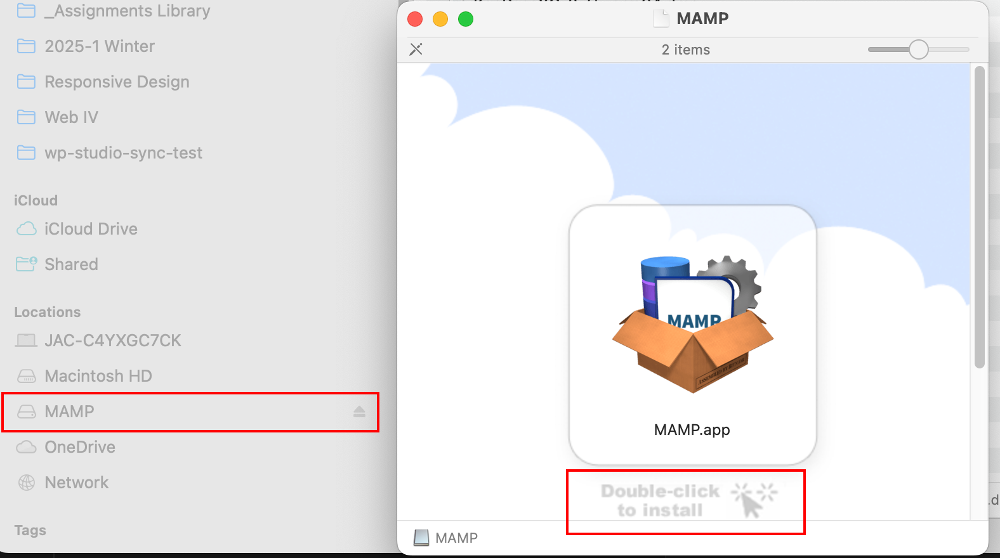

1. Double-click to mount the DMG as a volume available to be read by your system.
2. Double-click to start the installer.

## 3. Disable all optional software

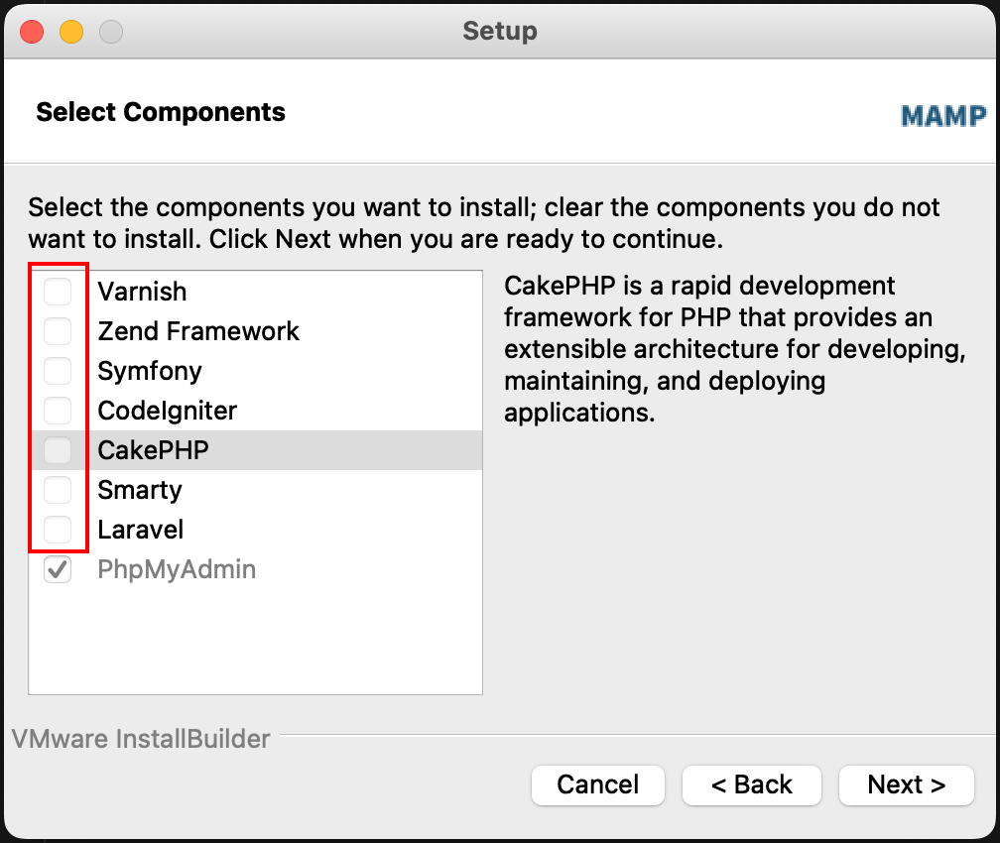

We only need the basics in this class.

## 4. Install in a Local Folder (not cloud synced)

### If you are installing on your own computer <a href="https://www.mamp.info/en/mac/">please use MAMP instead!</a>

If you are installing Bitnami or MAMP on your own macOS machine, <strong>do not install the software in a folder that is saved to iCloud</strong>. For example: Desktop or Documents. 

You can create a new "Local Documents" folder within your home Documents folder and install the software there.

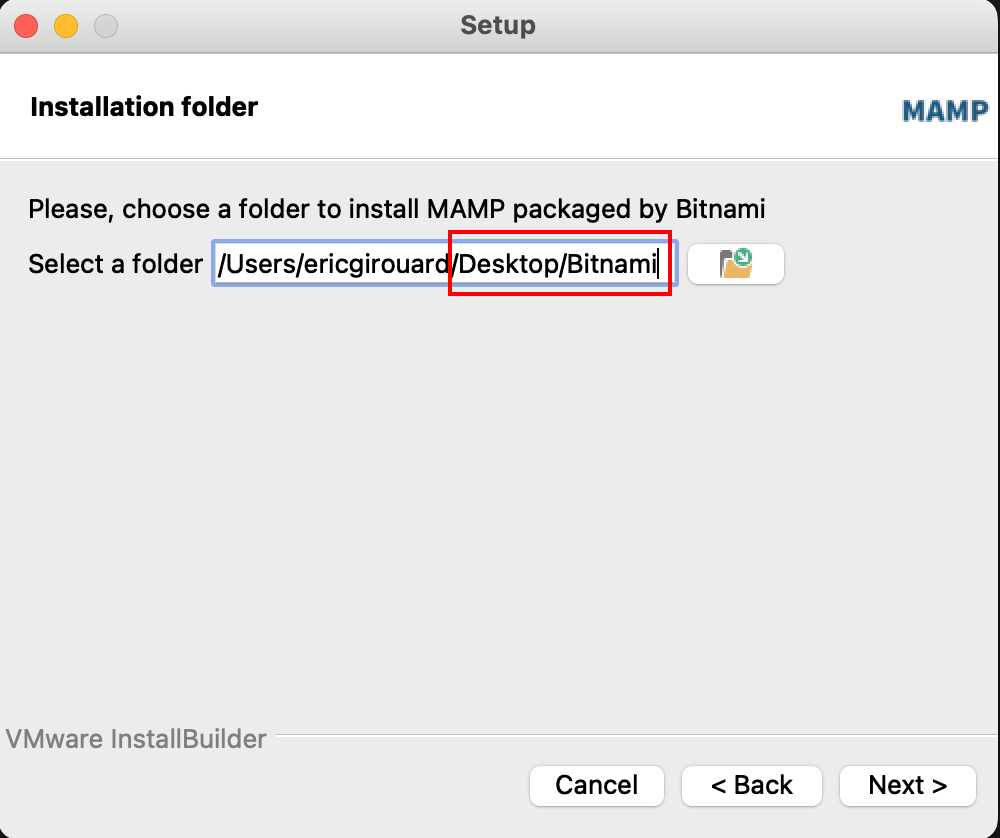

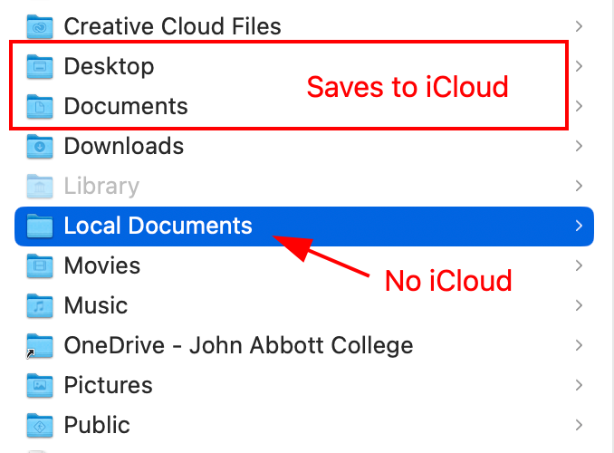

### Alternatively, turn iCloud Desktop & Documents Sync off

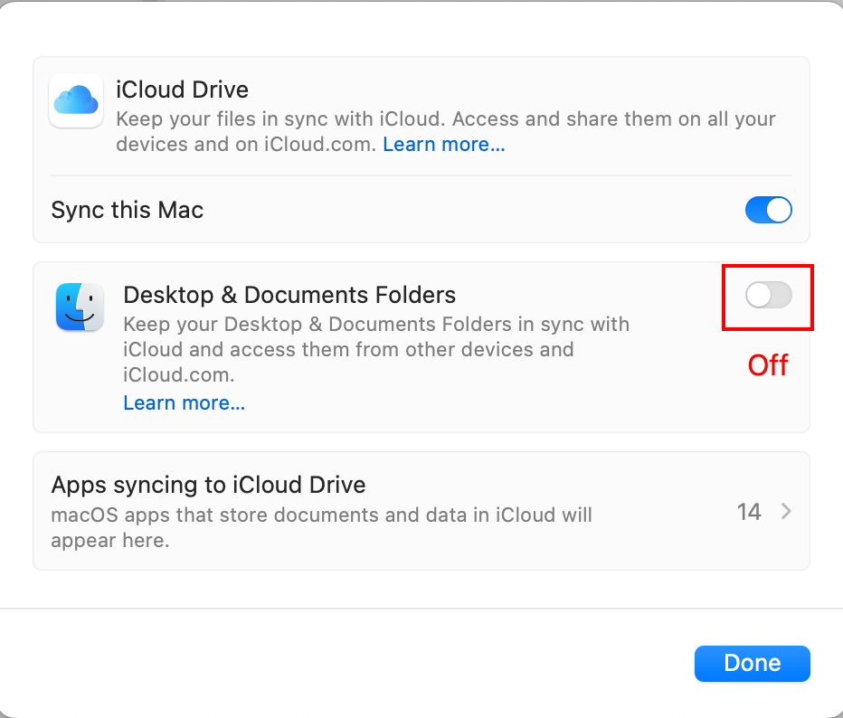

## 5. Root User Credentials

<blockquote>

## Super Important

Do not forget these credentials! 

1. Create a plain text file, named it "bitnami.txt"
2. Write the user name "root" and your chosen password inside it
3. Save it in the same folder as the Bitnami folder
4. Suggestion: user: root and password: bitnami

</blockquote>

### What is a root user?

"The root user is the most powerful entity in the Linux universe with limitless powers, for better or worse. Create a user? Got it. Annihilate a file system? Whoops, got that too."

See this article on the root user story: [https://www.howtogeek.com/737563/what-is-root-on-linux/](https://www.howtogeek.com/737563/what-is-root-on-linux/)

## 6. No Cloud Option

We do not need to use the Bitnami cloud services.

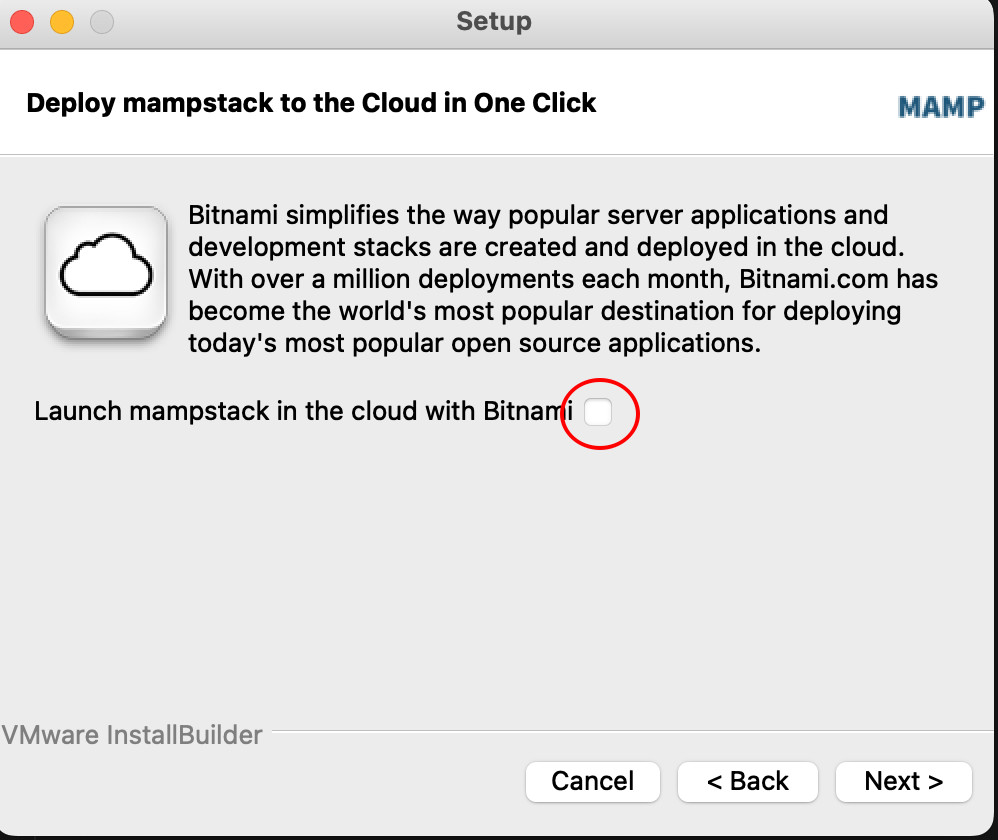

## 7. Proceed to the installation

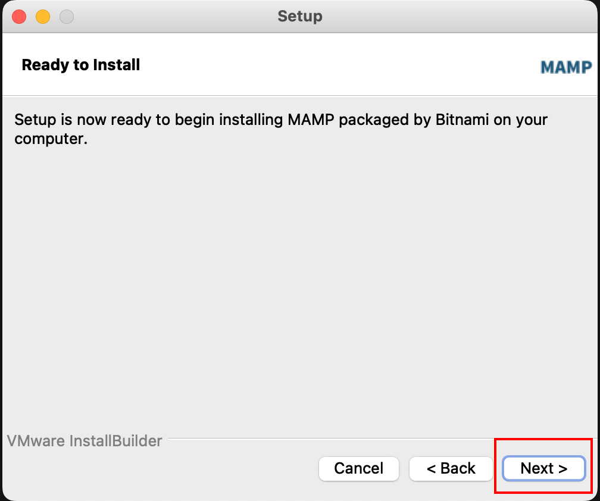

## 8. Wait for the installation to complete

(It takes a while...)

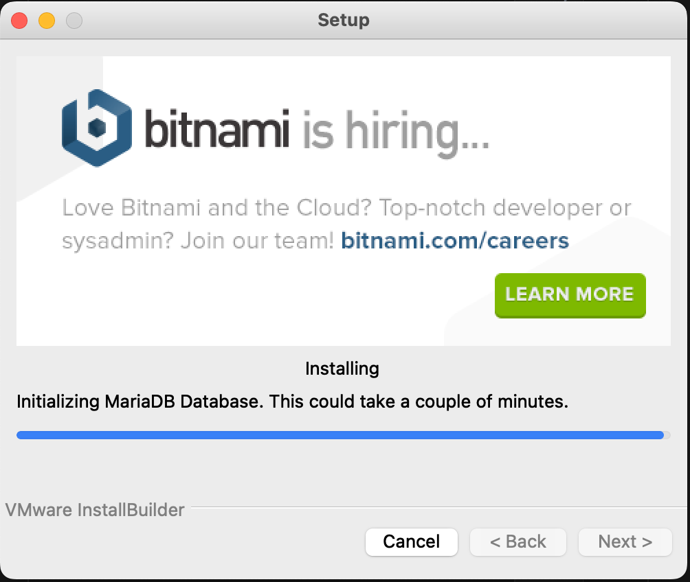

## 9. Launch MAMP

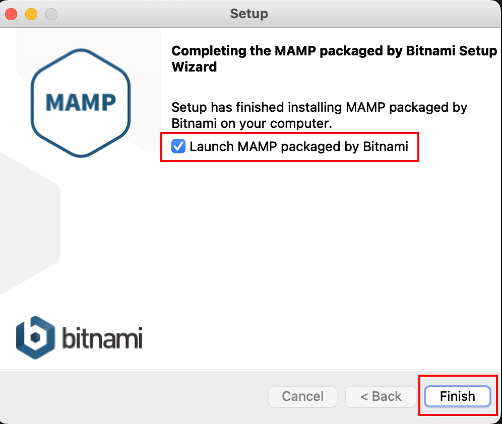

<blockquote>

### NOTE: Bitnami interface

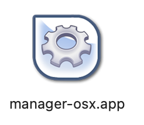

Bitnami (or MAMP) is automatically started when you install it. As a general rule, you must shut it down at the end of class by clicking "Stop All Servers".

When you come into class, make sure to start the servers using the Bitnami Manager OS X app.

Note that if the student in the previous class did not close down their servers, your servers may not be able to use the default port numbers when you launch them. The easiest solution in this case is to simply restart the computer the start your server software as usual.

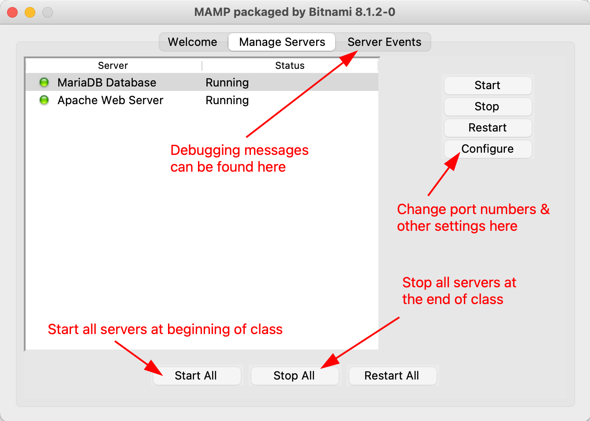

</blockquote>

## 10. A Good Sign

If you see these two green dots, it means everything is running the way it should.

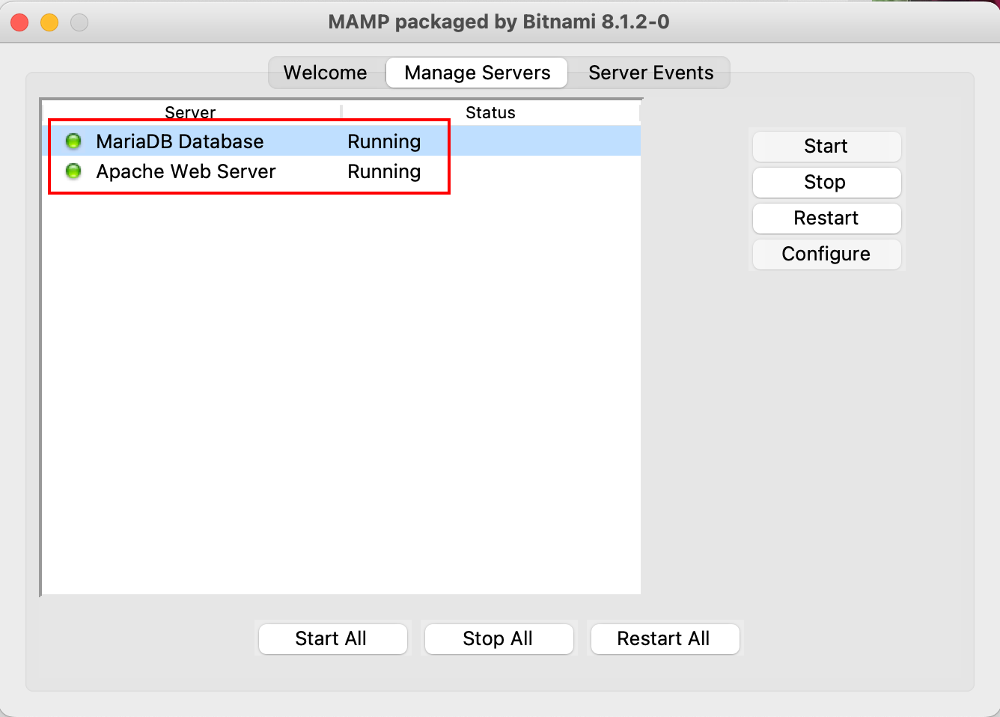

## 11. The Three Buttons

1. Opens the default web application installed in Bitnami/apache2/htdocs (in our case this will be Wordpress).
2. Opens the MySQL/MariaDB database management web application PHPMyAdmin.
3. Opens the Bitnami folder on your computer.

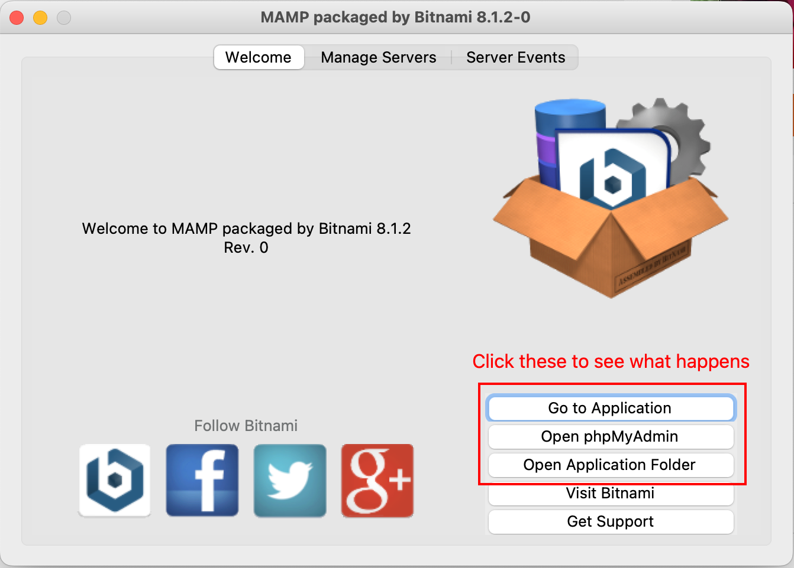

## 12. Always Shutdown at the End of Class

1. Always stop the servers and quit Bitnami at the end of class.
2. Otherwise, the next person coming in will not be able to use Bitnami with changing the configuration or restarting the computer!

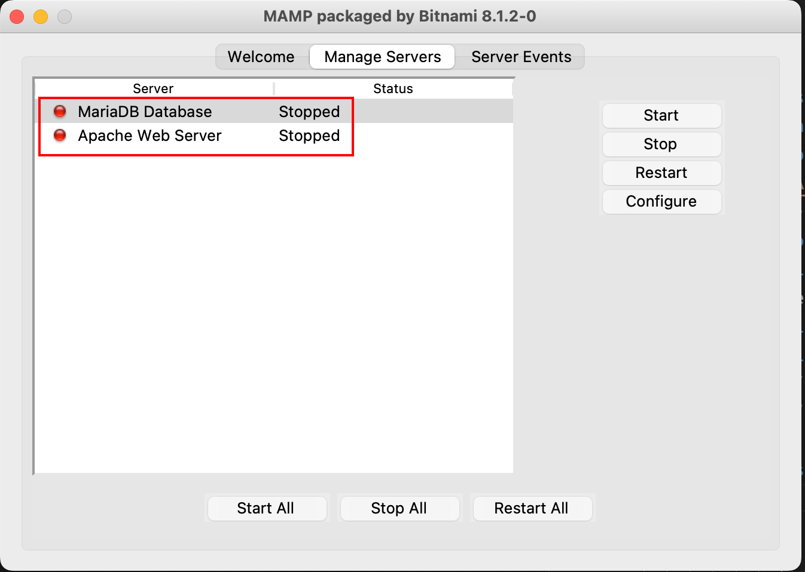

