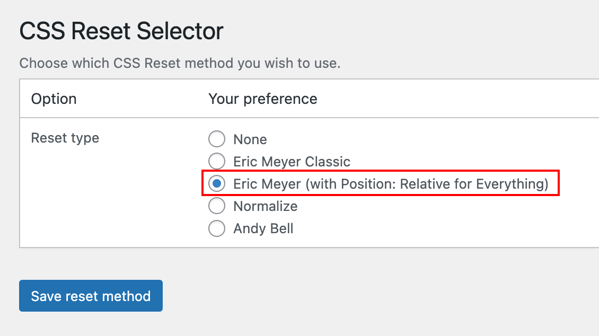
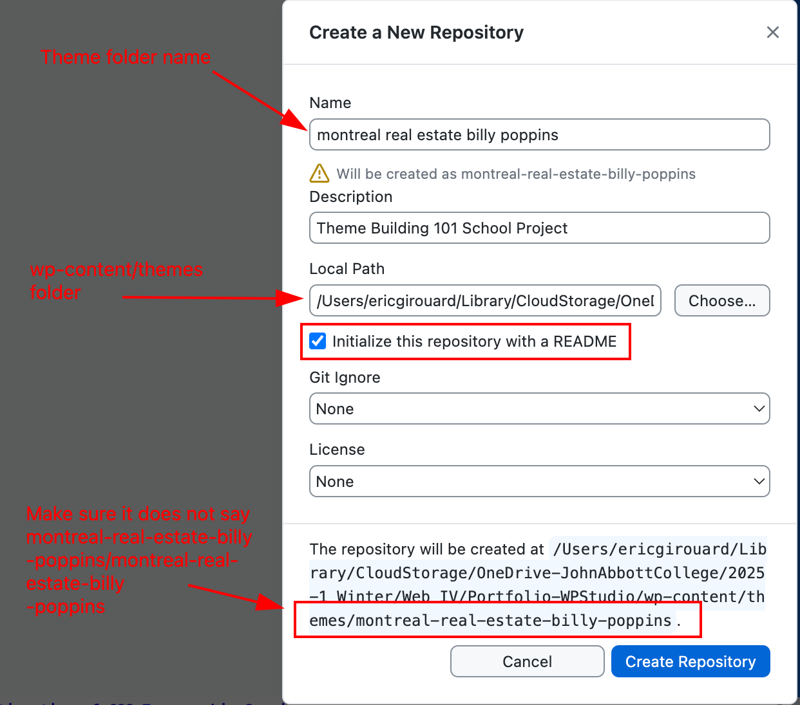
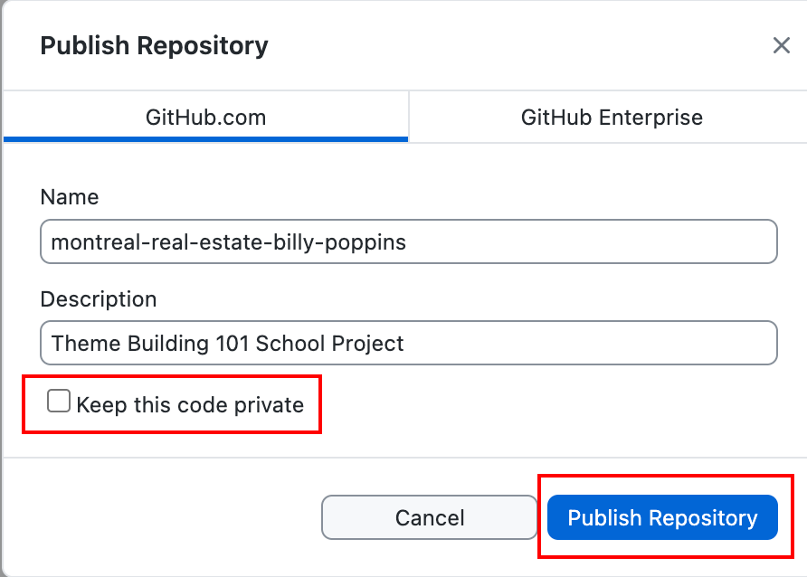
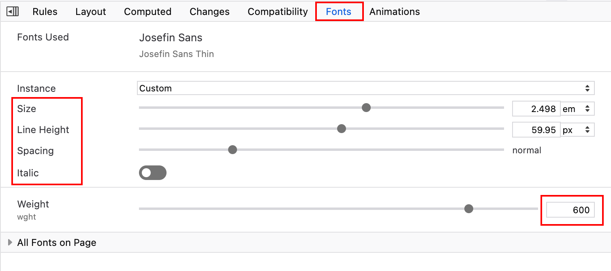

# Week 11b Class Notes

## CSS Reset Selector

Please make sure you have the latest version of the CSS Reset Selector plugin installed and activated.

1. [Download the latest version here.](https://github.com/JACGWD/CSS-Reset-Selector/archive/refs/heads/main.zip)
2. Install the plugin
3. Activate it
4. Go Settings > CSS Reset Selector
5. Select the "Eric Meyer (with Position: Relative for Everything)"
6. Click "Save reset method".

## Change folder and Text Domain Names

1. Inside WordPress's wp-content/themes/ folder, change the "montreal real estate" theme folder name to **"montreal real estate your name"**.
2. In style.css, change the "Theme Name" and the "Text Domain" accordingly.
3. In functions.php, change the text domains 'montreal-real-estate' in the menu builder code:

        /*  STEP 2.10 ADD THE MENUS */

            function add_my_menus() {
                register_nav_menus(
                array(
                    'header-menu' => __( 'Header Menu', 'montreal-real-estate' ),
                    'footer-menu' => __( 'Footer Menu', 'montreal-real-estate' ),
                    'social-menu' => __( 'Social Menu', 'montreal-real-estate'),
                    // YOU CAN ADD AS MANY MENUS AS YOU WANT HERE
                )
                );
            }
            add_action( 'init', 'add_my_menus' );

4. Check index.php and single.php for this line to change as well:
   
        _e( 'Sorry, no posts matched your criteria.', 'montreal-real-estate' );

5. Use the **Theme Checker** plugin to test that the theme modifications pass most checks (no red errors).

## Create a GitHub Repo for this project

1. Open GitHub Desktop
2. Click the top left corner
3. Select "Add"
4. Select "Create New Repository..."
5. Select the "themes" folder within WordPress's "wp-content" folder
6. Click "Publish Repository"
7. Uncheck the "Keep this code Private" box
8. Click "Publish Repository"
9. Click "View on GitHub", 
10. Click the green button
11. Copy the URL (ends with .git)
12. Send me the URL in a MIO

## Continuation of CSS Typographic Spacing

### Firefox Fonts Inspector

Use the Fonts Inspector in Mozilla Firefox to visually adjust your font parameters. Line height is normally expressed as either the keyword "normal" or a number, ex: line-height: 1.5; (meaning "line-height = a number of lines"). 

However, [line-height supports values expressed in px, pt, cm, %, etc](https://www.w3schools.com/cssref/pr_dim_line-height.php).

### Major Rules to Define per Tag

|CSS Property|Viewport|Comment|
|---|---|---|
|line-height {}|Both|aka leading||
|margin {}|Mobile|two important values: **top and bottom**|
|margin {}|Desktop|four values: top, right, bottom and left Mostly top and bottom|

<blockquote>
    
### EMs vs REMs

An **EM** is a value equal to the height of a lowercase letter m *in the chosen font face*.

An em can have different values if you are looking at the letter m in a paragraph, an H1 tag or an h4 tag. An em is ***context-sensitive***.

A REM is a "Root EM". It is a value equal to the height of a lowercase letter m in the chosen font ***of the root element***. **The value of a REM never changes.**
    
</blockquote>

## Lists

List require a bit of special attention as the CSS Reset removes space at the left which will hide the bullets or numbers.

        ul {
            margin: 1rem 0 1rem 2rem;  /* note the 2rem at left */
            list-style-type: disc;
        }

         ol {
            margin: 1rem 0 1rem 2rem;
            list-style-type: decimal;
        }

### An Image as The List Item Marker

The list-style-image property specifies an image as the list item marker:

        ul {
            list-style-image: url('img/icon.png');
        }

See: [this Mozilla Developer page for other options](https://developer.mozilla.org/en-US/docs/Web/CSS/::marker)

## Pair Spacing

Once the basic HTML tags (h1-h6, p, li, etc) have been given their default spacing, you want to take a look at how these blocks of text look when paired with other elements on the page, such as images, tables, lists or inline frames ("iframes" such as Google Maps, or YouTube embeds).

**Pair Spacing** is the art of tweaking the space between Element A (ex: h3) and Element B (ex: table or iframe), when the default spacing isn't good enough. 

### Two Selectors for Two Tags

|CSS Selector|Selector Type|Selected Item within the Pair|Target Tag|Links|
|---|---|---|---|---|
|h2:has(+ ol)|"Has" Pseudo-Class|First|\<h2>|[https://www.w3schools.com/cssref/sel_has.php](https://www.w3schools.com/cssref/sel_has.php)|
|h2 + ol {}|Next Sibling|Second|\<ol>|[http://www.w3schools.com/CSSref/sel_element_pluss.php](http://www.w3schools.com/CSSref/sel_element_pluss.php)|

### CSS :Has() Rule to Select the First Tag of the Pair: the H2

        h2:has(+ p) {
            margin: 0 0 0.347em;
        }   

        h2:has(+ img) {
             margin: 0 0 0.667em; /* pictures look better with more space above */
        } 

### CSS "Next Sibling" Selectors to Select the Second Tag of the Pair

Next Sibling selector rules are applied to the **second tag**. For example, in the first rule below, the \<ol> tag is the one that gets its margins adjusted.

        h2 + ol {
            margin: 2rem 0 0 2rem 0;  /* margins for the ol */
            }

        h2 + table {
            margin: 0.5rem 0 0 2rem 0;   /* margins for the table */
        } 

        h2 + h3 {
            margin: 0.25rem 0 0 2rem 0;  /* margins for the h3 */
        }       

## Redefine Font Sizes for Desktop

Once you leave the small mobile device screen sizes behind, you can redefine the font scale to accommodate larger font sizes. This will give your scale more contrast, enhance the overall legibility, and UX for the end user.

    /* TYPESCALE for MOBILE 
        https://spencermortensen.com/articles/typographic-scale/  */

    h1 { font-size: 2.5em; }
    h2 { font-size: 2.1459em; }
    h3 { font-size: 1.842em; }
    h4 { font-size: 1.5811em; }
    h5 { font-size: 1.3572em; }
    h6 { font-size: 1.165em; }
    p { font-size: 1em; }
    small { font-size: .8584em; }
    
    legend {font-size: 1.842em; }  /* h3 */
    label {font-size: 1.5811em;}  /* h4 */
    figcaption { font-size: .8584em;}  /* small */

    @media screen and (min-width: 60rem) {

    /* TYPESCALE for DESKTOP: ADD CONTRAST   */

    h1 { font-size: 3.558em; }
    h2 { font-size: 2.8796em; }
    h3 { font-size: 2.3306em; }
    h4 { font-size: 1.8863em; }
    h5 { font-size: 1.5266em; }
    h6 { font-size: 1.2356em; }
    small { font-size: .8093em; }

    legend {font-size: 2.3306em; } /* h3 */
    label {font-size: 1.8863em;}   /* h4 */
    figcaption { font-size: .8093em;}  /* small */

    } /* always add a comment next to the closing media query bracket 
         so you don't delete it accidentally */

## Micro-spacing Adjustments

Once you have completed your spacing using margins and the two sibling selectors, if the margins are set to zero and you still want to reduce a space (*try to avoid using negative margins*), you can still tweak the position of an element by **using relative positioning**.  

This works best for tiny adjustments, as large adjustments can make elements overlap.

    figcaption {
        font-size: .8584em;
        text-align: right;
        font-style: italic;
        margin-top: 0;

        position: relative; /* when margins are zero, you can still tweak */
        top: -0.3rem;
    }

## Ponderation for this milestone

### Due Friday, at 8am

<table>
<tr><th>Criteria</th><th colspan="3">Grade</th><th>Total</th></tr>
<tr><td>Google font properly added in &lt;head&gt;</td><td>&nbsp;</td><td>Fail</td><td>Pass</td><td>5%</td></tr>
<tr><td>Google font for H1-H6 Headers</td><td>&nbsp;</td><td>Fail</td><td>Pass</td><td>5%</td></tr>
<tr><td>Google font for Body</td><td>&nbsp;</td><td>Fail</td><td>Pass</td><td>5%</td></tr>
<tr><td>Default Spacing for Tags</td><td>Fail</td><td>Pass</td><td>Pro</td><td>10%</td></tr>
<tr><td>Pair Spacing for First Tag</td><td>Fail</td><td>Pass</td><td>Pro</td><td>10%</td></tr>
<tr><td>Pair Spacing for Next Sibling Tag</td><td>Fail</td><td>Pass</td><td>Pro</td><td>10%</td></tr>
<tr><td><strong>Overall Typographic Aesthetics</strong></td><td>Fail</td><td>Pass</td><td>Pro</td><td>55%</td></tr>
</table>