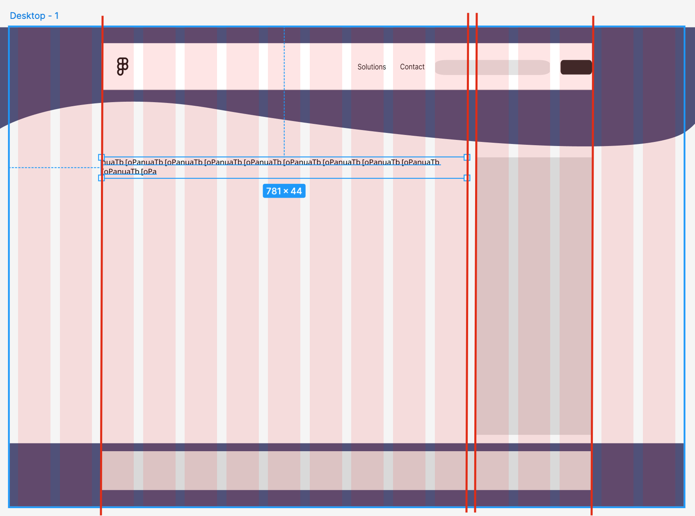
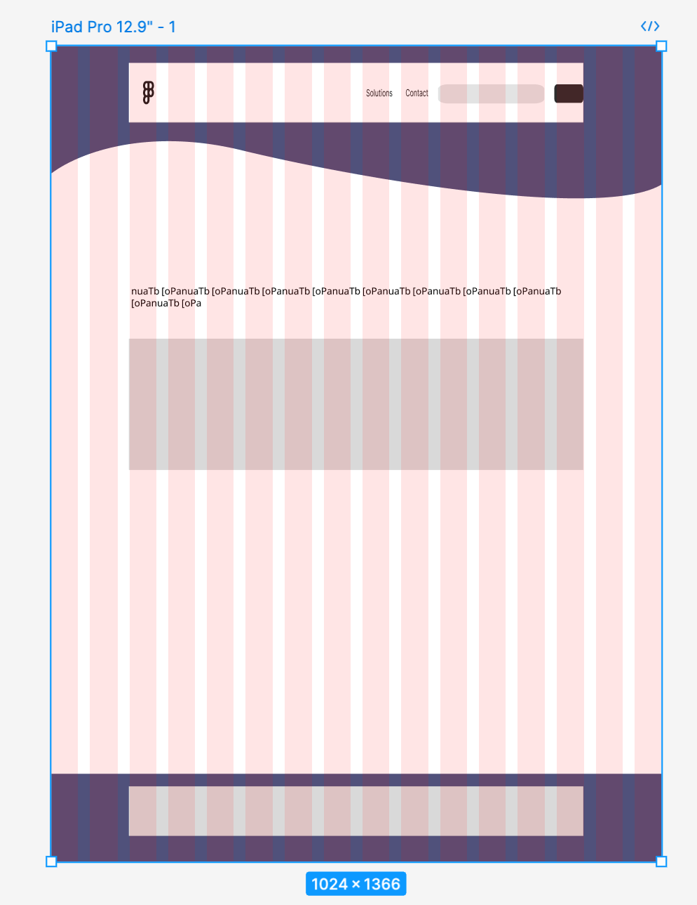
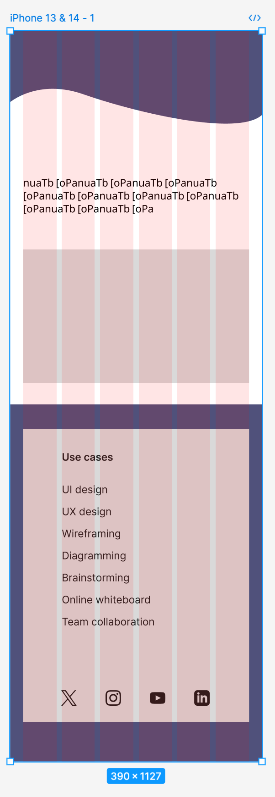

# Header, Nav & Footer Design

<blockquote>

## Important

Please create an account on [Figma](https://www.figma.com) using your johnabbottcollege.net credentials. 

*There is no need to use the desktop application. Most professionals use the web application.* 

</blockquote>

## Objective

Create a header, navigation and footer style for the Montreal Real Estate site. The design must be responsive: ie works for mobile, tablet and desktop size viewports. 

## Thematic Objective

**The design must fit the personality of the business owner.**

- Mature, professional, trustworthy (but not in an old fashioned/conservative way)
- Strong, bold
- Adventurous 
- Nature oriented 
- Sustainable/eco-friendly
- Experienced

## Practical Objective 

The main objective of the site is to facilitate new users to reach out and establish contact with Jennifer via email or telephone. 

**All other aspects of the site are secondary to recruiting new customers.**

## How To 

### Basic Grid Design

<blockquote>

### Important note about Photoshop/pixel artwork

When designing assets for responsive web design, **vector artwork is the most versatile** as it is **resolution independent**. It can therefore be scaled to any size. This means that a single vector file can be used for mobile, tablet and desktop scales without any loss of visual quality.

Artwork produced in Photoshop (or other bitmap/pixel-based editors) as it is **created at a fixed resolution**. The best way to create assets using Photoshop is to create the assets in a document that is the **largest screen size you need to support** (ex: 4k screens) and then resave the artwork multiple times **going down in size**. Ex: 4k > 2560px > 1920px > 1440px > 1024px, etc.

</blockquote>

- Start with the desktop artboard
- Use the same Google fonts as in your CSS
- Turn on the columns view 
- Choose 16 columns
- Create a "word" 80-100 characters wide **in your chosen body font at 16px size**
- Center the "word" in the artboard
- Adjust the columns and gutters until they align with the width of the "word"
- This represents the ideal width of \<main>
- Note the number of columns wide \<main> is. Ex: 7
- Reserve a space (number of columns) for the sidebar. Ex: 3
- 7+3=10 columns of content area
- 16-10 = 6 columns negative space (3 at left and 3 at right of main + sidebar box)

### Repeat for Tablet

- Create a tablet size artboard
- Repeat the same basic column building exercise as above
- Smaller tablets may not necessarily fit the full 80-100 characters line (that’s okay)
- Do not change the font size
- Try to maintain the same background/foreground relationship in terms of columns of negative space vs content box space. Ex: 2-12-2=16 or 3-10-3=16. Adjust as necessary. 
- Try switching to a 12 column grid if necessary. 

### Repeat for Mobile

- Mobile is used as a single column display
- We still use a multiple column grid to determine outer margins and the width of elements that can go side-by-side on mobile. Ex: form buttons
- Try 4-6-8 columns. 

## Header Design

- Create a background image will help the header be instantly recognizable 
- Avoid flat color rectangles 
- Reserve space for the custom logo
- Add search field and button
- Reserve space for site name
- Reserve space for site tag line
- Come up with logo proposal
- Apply to mobile, tablet and desktop artboards

## Navigation Design

Looking at the current [Montreal Real Estate site](https://www.montreal-realestate.ca) analyze which sections in the menu are still needed, and which could be cut. 

Remember that the site is twenty years old and blogging isn’t what it used to be. Nor is every section still useful to the core objective of making new customers reach out to Jennifer. 

**Be strategic here. Write down why you would cut a part of the site.**

Using the **small** text size in your typographic scale, layout your updated menu on the **desktop artboard**. 

**Note the minimum width needed to display the menu.** Any viewport narrower than this will need a mobile style menu that uses the hamburger icon. 

- Design the appearance of the menu for:
    - Mobile (with hamburger icon + vertical menu)
    - Tablet (with mobile style menu)
    - An extra artboard that shows the horizontal menu being displayed **at the narrowest size possible** (this is when the media query kicks in)

## Footer Design

Looking at the current [Montreal Real Estate site](https://www.montreal-realestate.ca) analyze which sections in the footer menu are still needed, and which could be cut. 

**Also consider which less important links could be moved from the main menu to the footer menu.**

Also find what social media links the site has that need to be added to the "social" menu. 

**Be strategic here. Write down why you would cut a part of the site.**

### Footer Layout

Using the **small** text size in your typographic scale, layout your updated footer contents (ex: copyright notice), footer and social menus on the **desktop artboard**. 

**Keep the alignment of the footer content inline with the edges of the main + sidebar width.**

*Look at different web sites for inspiration on footer designs.* 

**Note the minimum width needed to display the footer content horizontally.** Any viewport narrower than this will need a mobile style vertical stack of the footer elements. 

- Design the appearance of the footer for:
    - Mobile (vertical stack)
    - The horizontal footer being displayed **at the narrowest size possible** (this is when the media query kicks in).

## Background Options

In general, a white background color is considered the optimal choice for the central area of a web site. The header and footer offer contrasting colors and/or textures and/or photos. 

### Home page

The **home page** however is a totally different creature compared to all the other pages. It must catch the reader’s attention immediately be and visually pleasing. *You never have a second chance to make a first impression.* 

Determine if you would use a full page photo (or video?) background for the home page. Or not. 

Write down why/why not. Also define at what sizes you would do so (mobile, tablet or desktop).

**Share the Figma document with me via email when done.**

