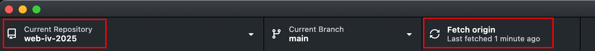

# Week 2 Course Notes

<blockquote>

## Reminder: Winter 2025 Deadlines
This semester, all projects and assignments are **due by Friday morning at 8am** (unless instructed otherwise).

</blockquote>

<blockquote>

## Reminder: Always Sync the Class Repo

At the start of any work session, at school or at home, open GitHub Desktop, select the Web IV repo and click "Fetch Origin" to **pull** the latest information from the server to your workstation.

</blockquote>

## Manually Installing WordPress on Bitnami/MAMP

[Manually Installing WordPress on Bitnami/MAMP](./week-2/manually-Installing-wordpress.md)

## Installing WordPress using WordPress Studio

[Installing WordPress using WordPress Studio](./week-2/installing-wordpress-studio.md)

## Useful Links

### Web Developer Toolbar

The Web Developer extension adds various web developer tools to a browser. The extension is available for Chrome, Edge, Firefox, and Opera, and will run on any platform that these browsers support including Windows, macOS, and Linux.

**Please install in Firefox and Chrome.**

[Web Developer Toolbar](https://chrispederick.com/work/web-developer/)