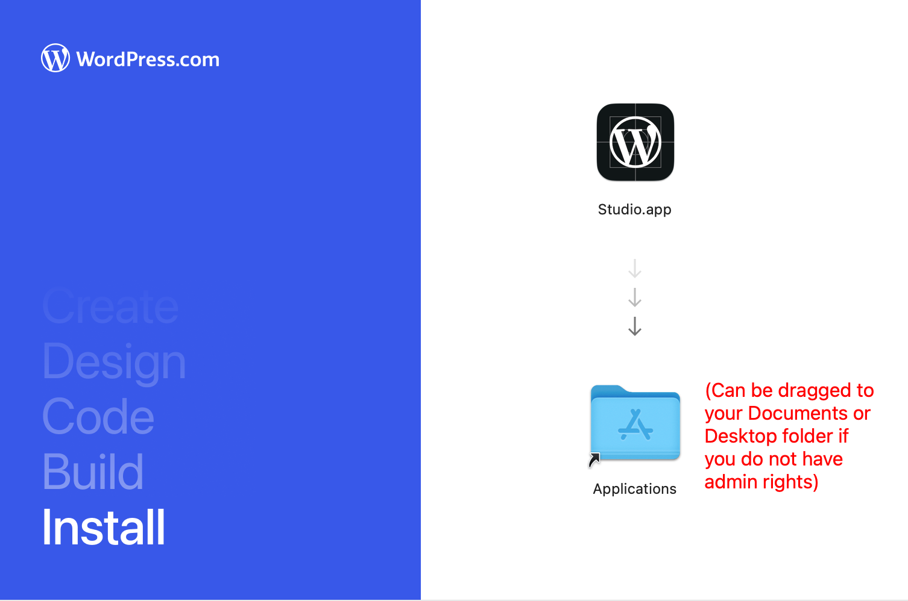
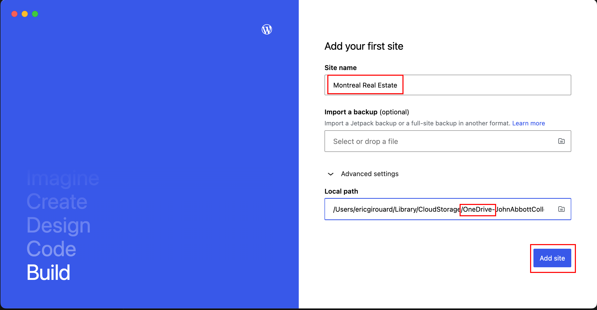
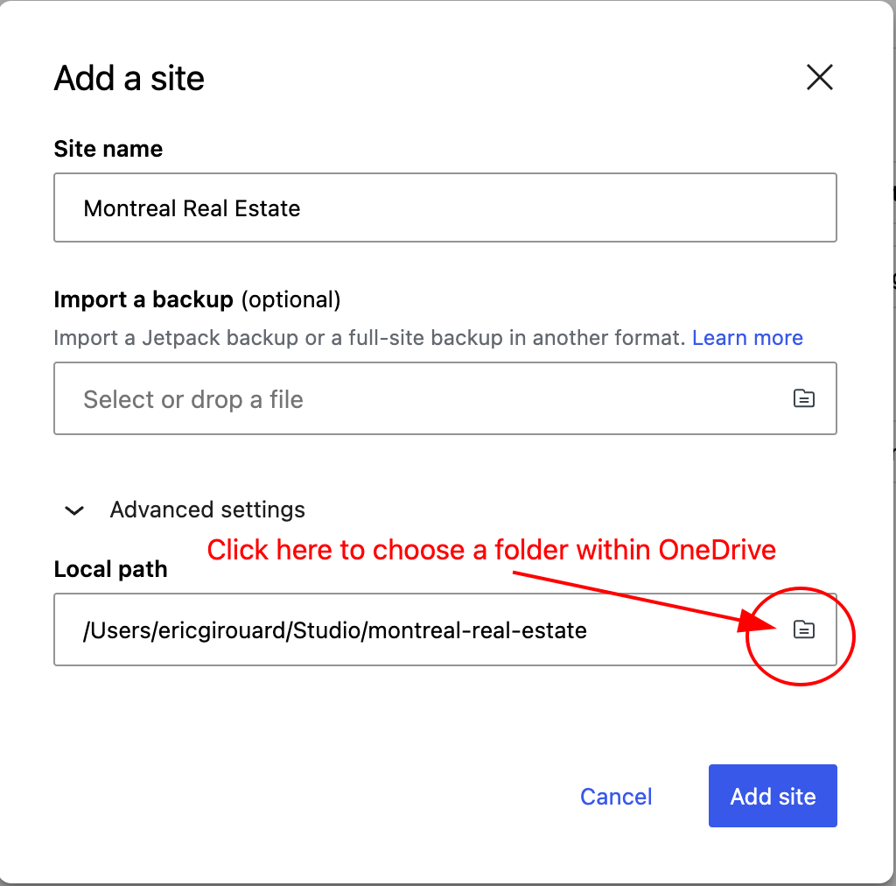
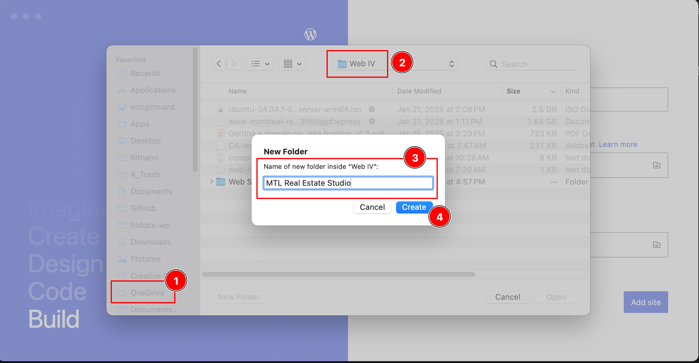
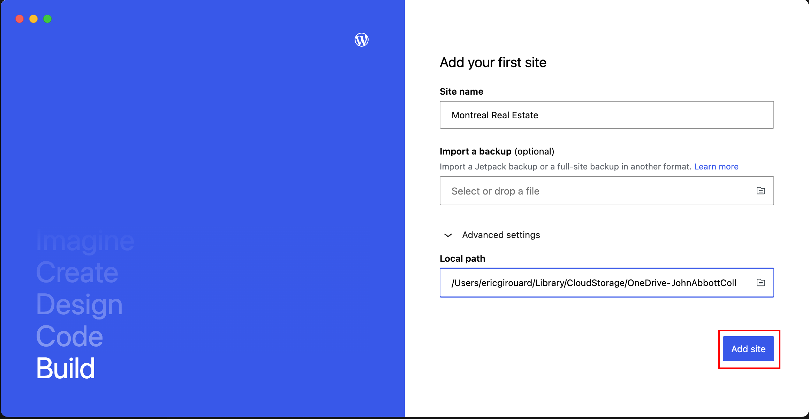
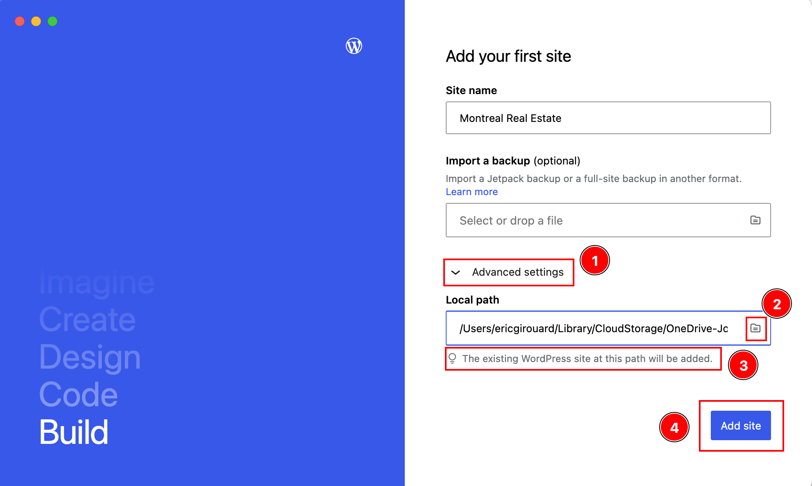
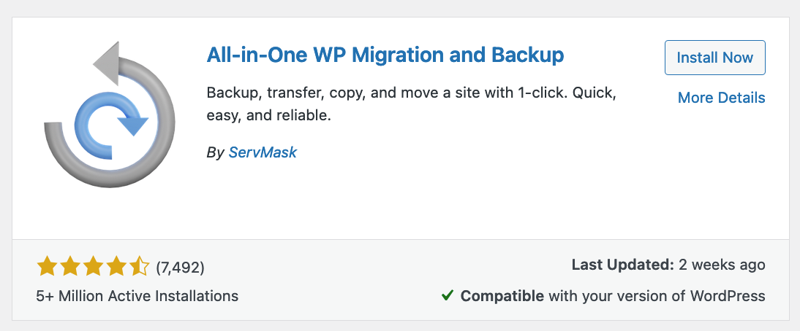
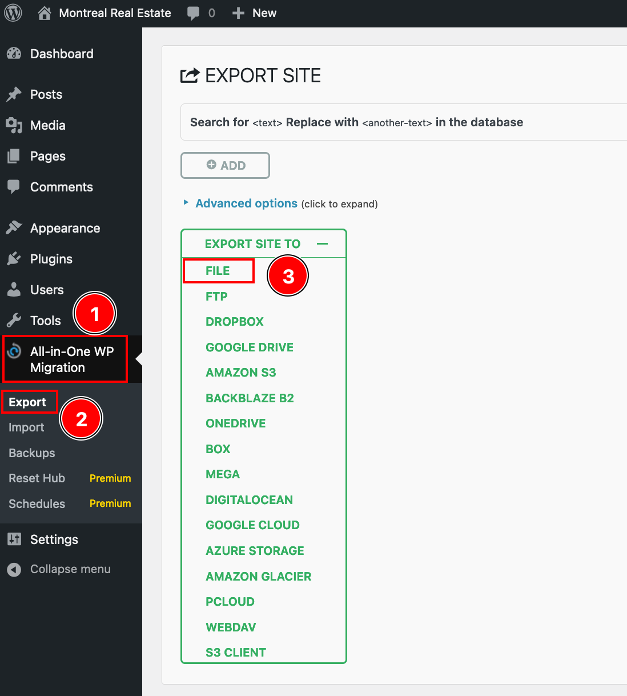

# Installing WordPress using WordPress Studio

## Get the Installer

WordPress Studio is [available for macOS and Windows](https://developer.wordpress.com/studio/). If you use **macOS**, make sure to choose the version for your type of CPU:

1. Apple Silicon (M series chips)
2. Intel (older x64 CPUs)

### In GWD labs

On the departmental lab computers, the application should already be installed. If it is not, you can simply download the installer and drag and drop the application into a folder inside your home folder. *You do not have admin access to the Applications folder.*

## Start the Application

<blockquote>

### MAMP vs Studio

The big difference in between Bitnami/MAMP and WordPress Studio is that **Studio** is designed to be frontend for [wordpress.com](https://www.wordpress.com), which is [Automattic](https://automattic.com/)'s **paid hosting service**.

**MAMP** is a software designed to run the **open source software** that Automattic distributes on the **wordpress.org** site.

</blockquote>

## Install WordPress

Use the name of the client: Montreal Real Estate

### Install into OneDrive

We will install the files into OneDrive to get the following benefits:

- Instant backup to the cloud
- You can work in the GWD lab and at home without doing extra steps

During the installation, select **Advanced Settings** and navigate to a folder inside OneDrive to save the site. Ex: onedrive/fourth-semester/web-iv/montreal-real-estate/

<blockquote>

### Important: Make sure OneDrive is Running

Both at school and at home, make sure that the OneDrive application is actually running. Sometimes when there is a software update, OneDrive does not automatically start.

</blockquote>

### Add Site

## How to Import the Site from OneDrive into Studio

1. Install WordPress Studio
2. Click Add Site
3. Navigate to the folder in OneDrive where you saved the site at school
4. It will say "The existing Wordpress site at this path will be added".
5. Click "Add Site".

## Better Safe than Sorry: Backup Often

After each Wordpress session, at school or at home, please use the [All in One Wordpress Migration plugin](https://downloads.wordpress.org/plugin/all-in-one-wp-migration.7.88.zip) to create a backup of your site.

1. Install the plugin above (the link is direct)
2. Activate the plugin
3. Go sidebar menu > All in One > Export > File > Download

<blockquote>

### Important: Save the Backups in OneDrive but not inside the Web Site folder

Do not save the backups inside the htdocs public folder. Save them, for example, in web-iv/backups so you can access them anywhere but they are not taking up space within the web site.

</blockquote>