# Manually Installing WordPress on Bitnami/MAMP

## How to Install WordPress

### Installing WordPress

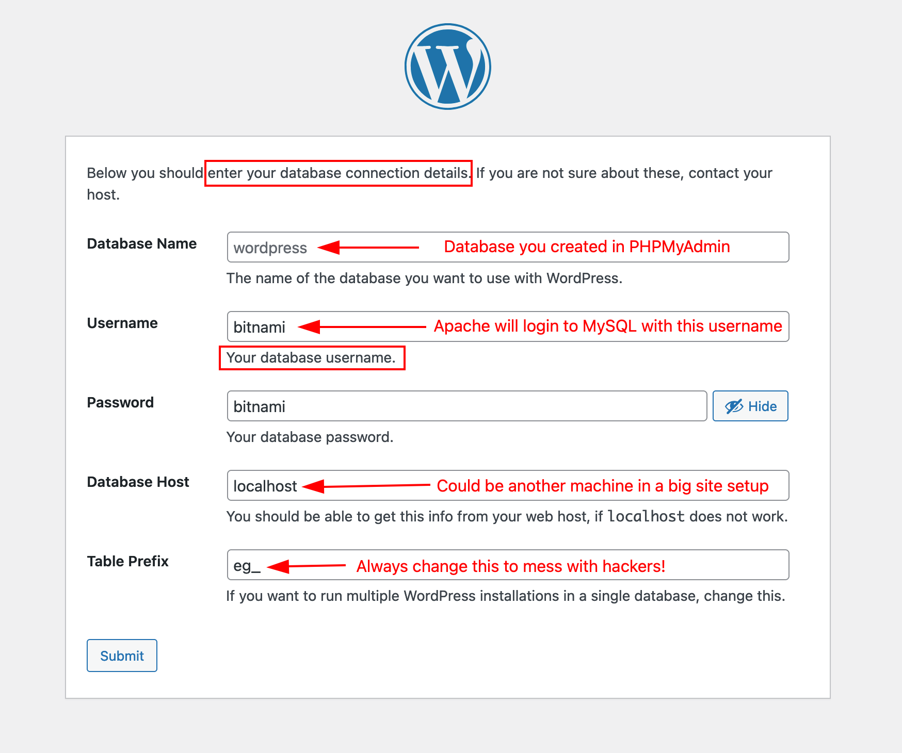

### Overview of the Required Steps

1.  Get latest version of Wordpress from [https://wordpress.org/latest.zip](https://wordpress.org/latest.zip)
2.  Decompress the archive. This creates a "Wordpress" folder.
3.  Backup the default Bitnami htdocs folder
    1.  Go to  Bitnami/apache2
    2.  Rename "htdocs" to "htdocs.bak"
    3.  Create a new empty folder called "htdocs"
4.  Move all the files (not the **folder** itself) from the Wordpress folder to Bitnami/apache2/htdocs/
5.  Open [http://localhost:8080/phpmyadmin](http://localhost:8080/phpmyadmin) (change port number if
    necessary, for example: http://localhost:8081).
6.  Login as "bitnami" with password "bitnami". (If this does not work, try username "root".)
7.  Create an empty database. Name it: jwdb
8.  Go to [http://localhost:8080/wp-admin/setup-config.php](http://localhost:8080/wp-admin/setup-config.php)
    (change port number if necessary).
9.  Follow the on-screen step-by-step. You will need this info:

    -   Database name: jwdb
    -   Database username: bitnami
    -   Database password: bitnami
    -   Database host: localhost:8080
    -   Database prefix: Your initials followed by an underscore (ex: eg_)

<h3>Security Tip</h3>

Similar to giving a spreadsheet tab a name, using a **database prefix** gives every Wordpress data table (ie like a spreadsheet tab) a unique name by adding a few letters to the beginning of the name. Hackers cannot know how you named the tables, so their job is made that much more difficult by adding this step during installation.

1.  You should now arrive at the "Famous Five Minute Install" prompt.
2.  Add your site info. (This can easily be changed later.)

<h3>Useful Links</h3>

### Online "Installing WordPress" Info from WordPress.Org

#### Basic Info

[https://codex.wordpress.org/Installing_WordPress](https://codex.wordpress.org/Installing_WordPress)

#### Creating a Database for WordPress

[https://developer.wordpress.org/advanced-administration/before-install/creating-database/](https://developer.wordpress.org/advanced-administration/before-install/creating-database/)

## Installing WordPress Step-by-Step

### Start the Installer

If you go to [http://localhost:8080/wp-admin/setup-config.php](http://localhost:8080/wp-admin/setup-config.php), you should be presented with the default "Choose the language" screen. Once you do that, there are certain pieces of information that you will need to know before you can proceed to install WordPress. These are the things we will do in the following steps.

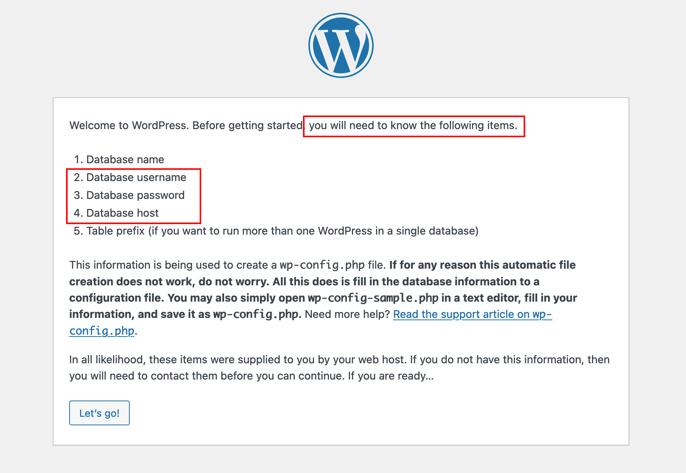

If you attempt to install now, you will get the following error message because we have not created the user account for the Apache web server to authenticate and communicate with the MySQL database server.

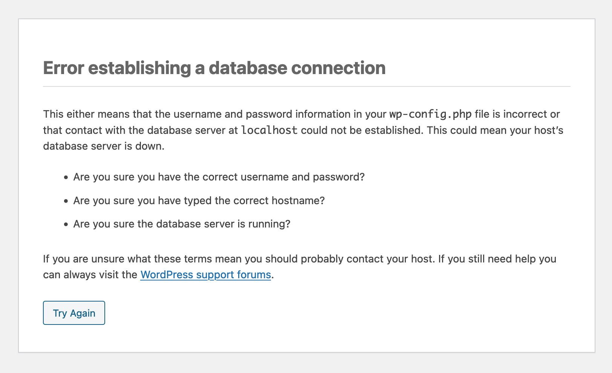

### Step 1. Create an empty database with PHPMyAdmin

1. Open [http://localhost:8080/phpmyadmin](http://localhost:8080/phpmyadmin)
2. Change port number if necessary, for example: http://localhost:8081
3. Login as "bitnami" with password "bitnami".  (If this does not work, try username "root".)

#### This is the main database management view in PHPMyAdmin

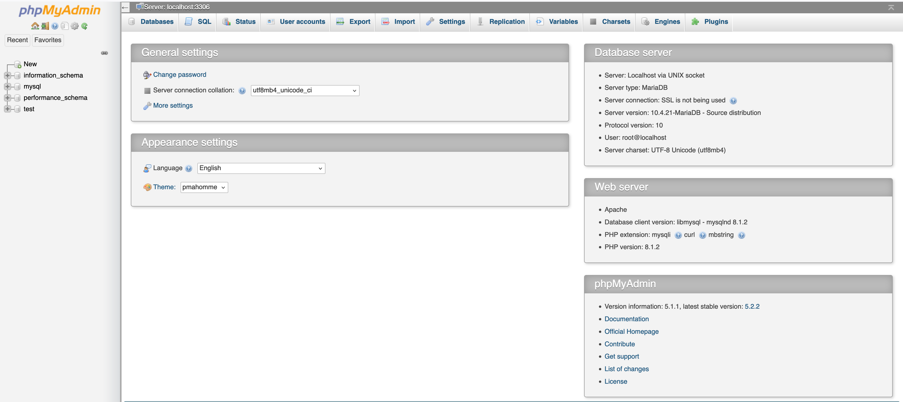

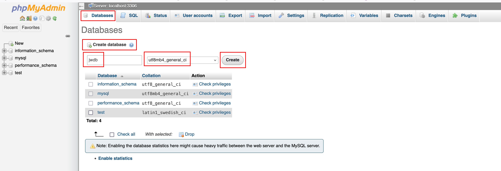

1. Click the "Database" tab.
2. Under "Create database", give your database a name and use the default collation.
3. Click "Create".

<h3>Definition</h3>

A **collation** is the character set (ex: Latin, Thai, Chinese, etc character support) used by the database to store the text. Same idea as using UTF-8 when writing HTML so that characters from different languages are not replaced by boxes or black diamond icons.

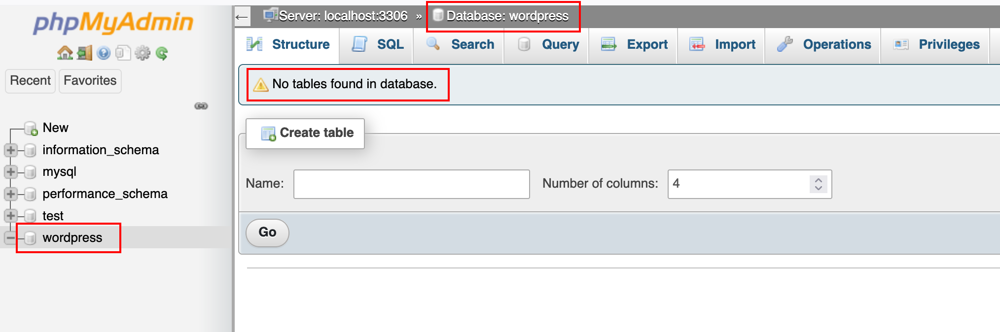

1. Select your new database in the left column of PHPMyAdmin.
2. The database will load into the PHPMyAdmin window, but it will tell you that the **database is empty: it has no tables. This is what you need WordPress to install.**

<h3>Security Tip</h3>

If doing this on a **real production server**, void obvious database names like "wordpress" or "websiteDB" to make any would-be hacker's life just that much more difficult.

### Step 2. Add a new MySQL user

When using a database-driven web site system, the different pieces of software (namely Apache and MySQL) have to talk to each other. To do this, they need to be allowed to do so by using a valid username and password. (Otherwise it would be very easy to hack.)

<h3>Test Material</h3> 

By default, Bitnami lets you use the root account but this is a very bad practice in terms of security.

(They do this so that setting up your home computer / development machine is any easy task. They expect you to change the username and password before you go public.)

 

We will create a new database username and password for this purpose.

1. Open [http://localhost:8080/phpmyadmin](http://localhost:8080/phpmyadmin)
2. Click the "User Accounts" tab.
3. Click "Add user account".

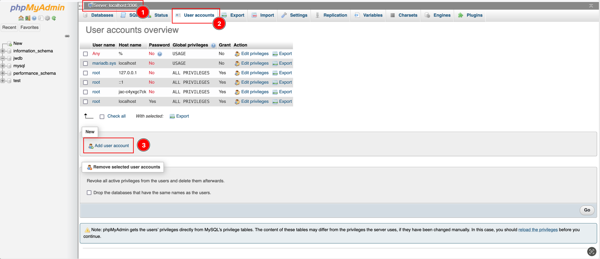

1. Add a **username**: bitnami
2. Add a **password**: bitnami
3. Click **Go**

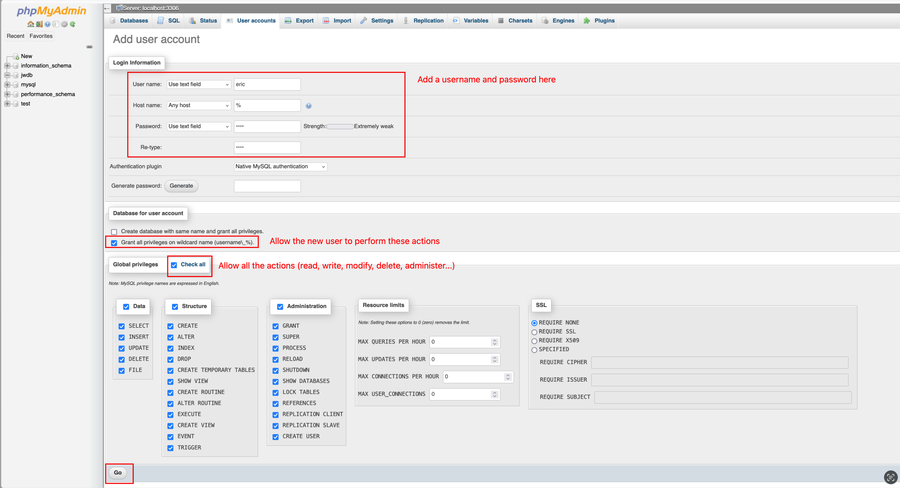

<h3>Security Note</h3> 

The strength of the password here is not important because this setup is not public. It will only exist on your computer and will not connect to the outside world. The username and password will change when you upload your site to the public server.

Add user account password

-   (Do not check any of the boxes at the bottom of this window.)
-   Click: Go
-   The window will refresh and you will see the next screen.
-   Tell MySQL what that user is allowed to do and on which database
-   On this screen, you will give the pdhtorg_1234567 user permission to
    use and edit the pdhtorg_1234567 database (where we will install the
    Wordpress tables).

 

 

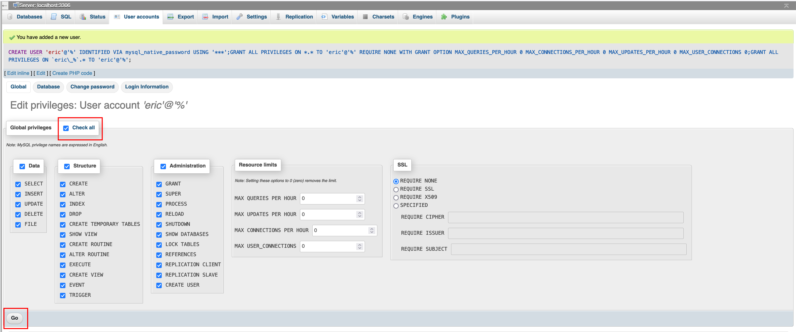

Click Check All

 

 

 

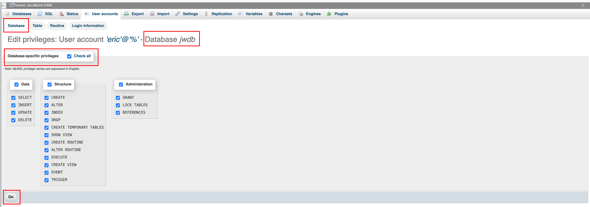

- MySQL user privileges
- Click Go
- You are now ready to proceed with the Wordpress installation in the web browser.
- Go to [http://localhost:8080](http://localhost:8080)

### Step 3. Browser-based Installation

#### Select Language

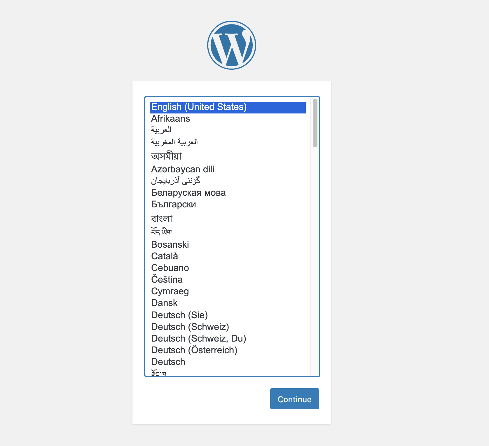

Select the language you want the site\'s backend to be in. (Ex: the backend control panel could be in French, but the site content could be in English.)

#### Enter Config Details

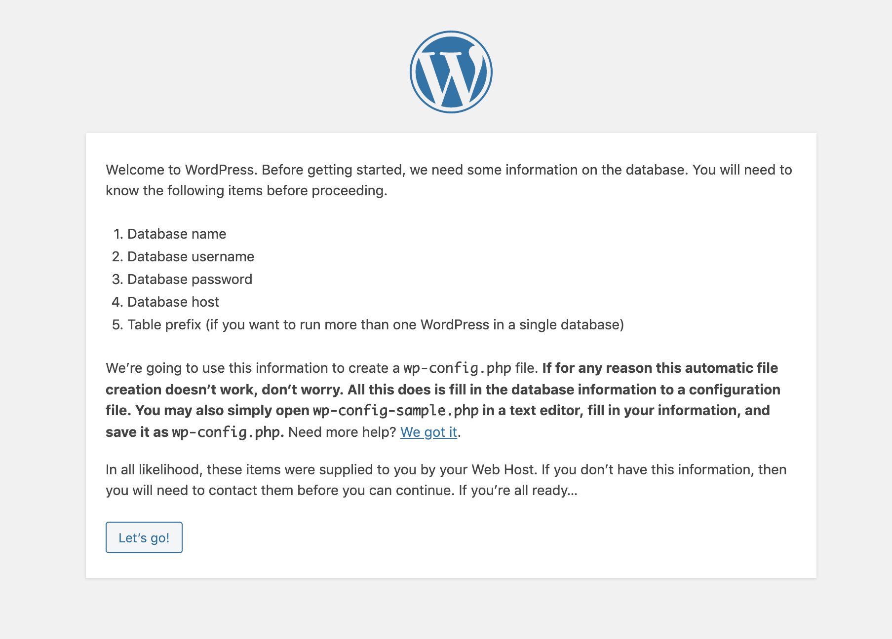

Make sure you have this information on hand.

 

-   Database name: jwdb
-   Database username: bitnami
-   Database password: bitnami
-   Database host: localhost
-   Database prefix: your initials followed by an underscore (ex: "bp_")

#### Add User Login Info

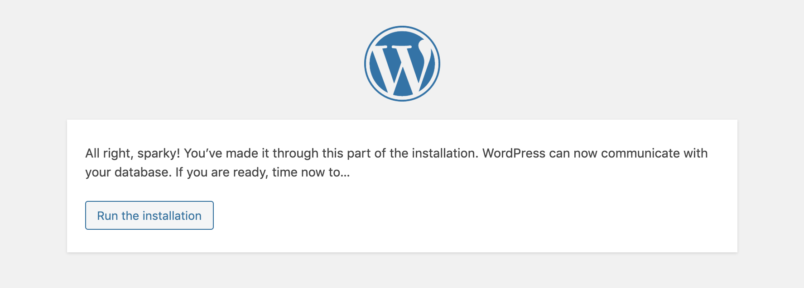

-   If you do not see this screen, check your credentials on the previous page.
-   **This page contains the info to log into Wordpress as a human, not into MySQL as a software.**
-   **The username will be public. Do not reuse the MySQL login info.**

#### All right sparky: Run the Installation

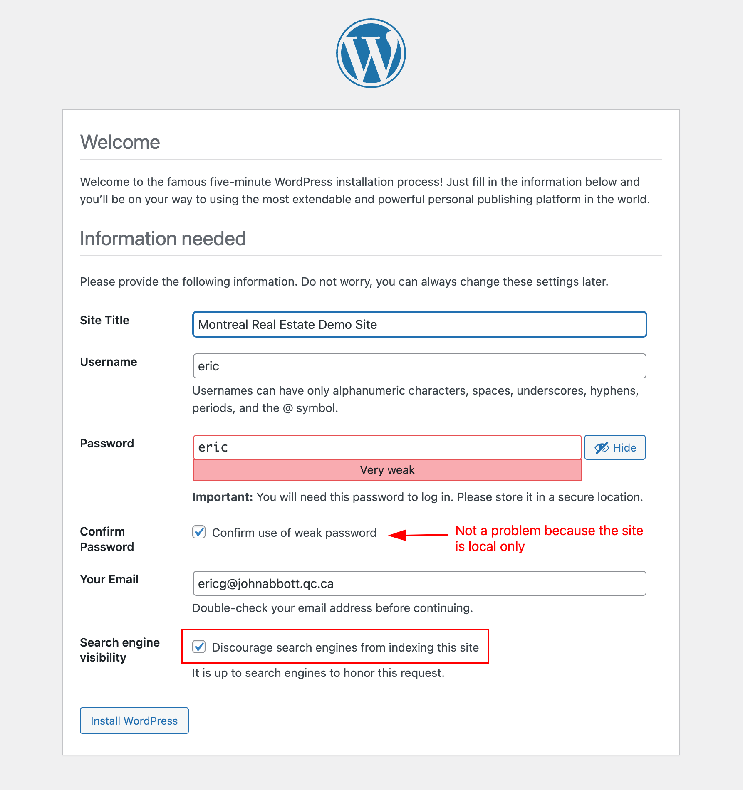

If everything was OK, you should see this screen.

<h3>Important</h3> 

Create a text file that you will save next to your Bitnami folder called "wordpress.txt". Add the username and password for the WordPress admin account you just created. **Do not** include this file in the htdocs folder.

#### Success!

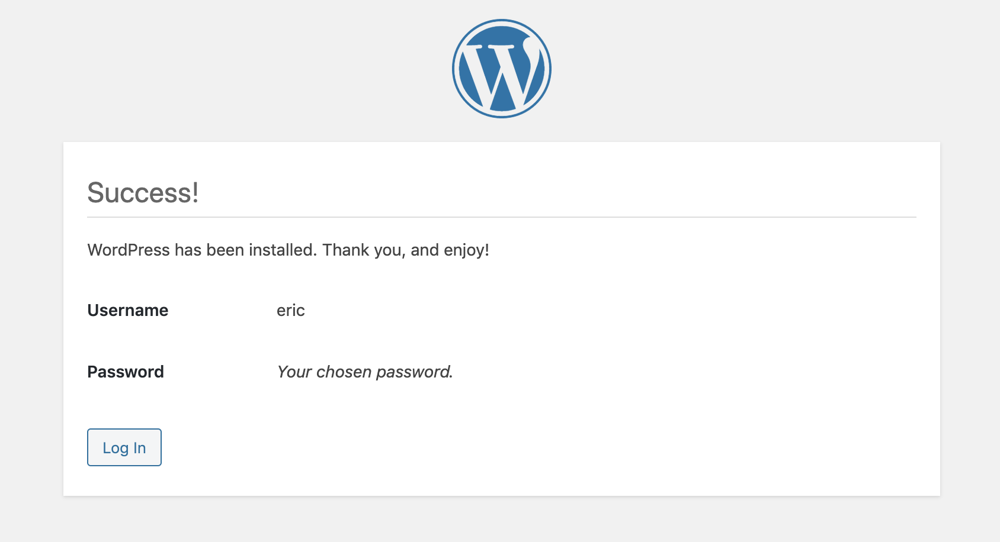

If you login here, you will be brought to the Wordpress control panel.

You can edit the URL, and go to [http://localhost:8080](http://localhost:8080) to see your site live for the first time.
 

####  Hello World!

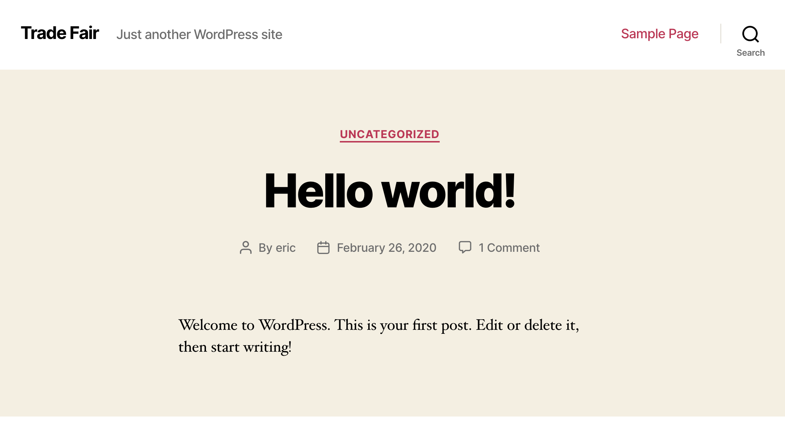

This is the default public Wordpress page. There is a theme, but no
content.

If you want to login to the control panel, go to
[http://localhost:8080/wp-login.php](http://localhost:8080/wp-login.php)
