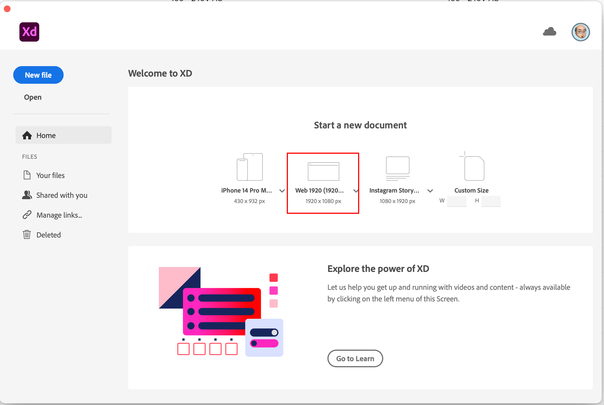

# Making a Video Prototype in Adobe XD

## 1. Create a web size artboard

## 2. Add as many artboards as necesary. Add one sketch per artboard.

## 3. Switch to Prototype Mode

## 4. Select the interface element that triggers the action

## 5. Drag the connector to the target artboard

## 6. Connect all the artboards

## 7. Select the starting artboard

## 8. Click Play

## 9. Click Record

## 10. Click Share

## 11. Make sure to share to Edit

