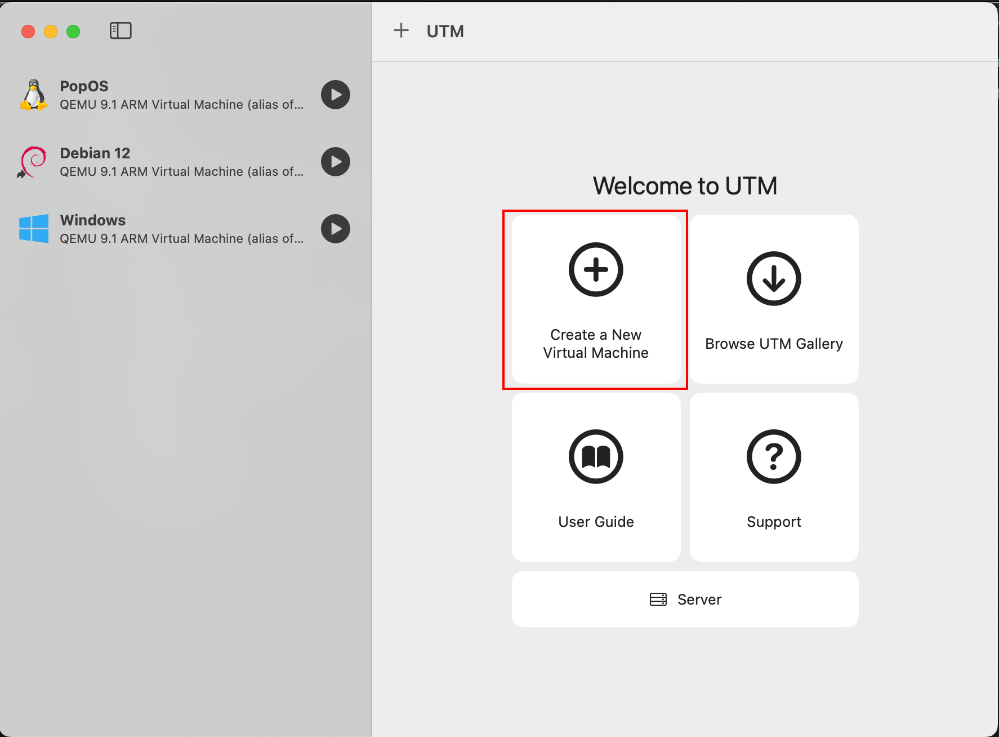

# Install a Virtual Machine Using UTM

## 1. Start UTM
In GWD, the UTM virtual machine software is preinstalled in the labs. Click its icon to start it.
## 2. Click create virtual machine

## 3. Select "Virtualize"

## 4. Select "Linux"

## 5. Browse to the ubuntu install disk and select it.

## 6. The default virtual hardware settings are fine.

## 7. The default virtaul storage settings are fine.

## 8. We do not need a shared folder for this project (but they are awesome to have).

## 9. You can ignore the Summary.

## 10. Click "Start".

## 11. Select the "Try" option by hitting the Return key.

## 12. When you see this screen, you can [start the exercise](./user-interface-analysis.md).
