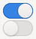

# User Interface Analysis Project

Sometimes, an interface project is to modernize a legacy system from a TUI to a GUI. 

Step one is to map the screens in the order they are seen when using the program. When all assembled, the series of screens will be a flowchart of the path the user follows. 

## Start the application to be redesigned 

Once the virtual machine has been started, you will follow the steps in the operating system installer. It is the interface design of this software, which is a Text-based User Interface, that we could be asked to modernize.

The first step in such a project is to do research to know the software in detail. We must be able to answer these questions:

1. How many screens are there in total?
2. How many options exist on each screen?
3. How many options provide sub-option screens?
4. What happens if there is an error?
5. Is there a way to go back? Or must you start over?
6. Is there any help?
7. etc 

The goal of the exercise is to map out all the screens a user has in this software, determine their purpose, and (eventually) design a GUI screen to replace every TUI screen. 

## Analyze the steps the user must take to accomplish the task

1. Take a cellphone picture (or screen capture) of each screen, in sequence (very important!).
2. Click every option to display every screen available and take pictures/captures of those.
3. Draw a simple diagram of each screen. (See the "meaning of interface widgets" section below.)
4. Add a number (and subnumber if necessary) to keep track of the order of the diagrams:

    1. Home screen
    2. User info
      - Name
      - Password 

5.  If a screen has to many options (ex: languages) do the first few then add an ellipsis (…) but indicate the total number of options required.
6.  In your sketches, replace the text-based UI with modern web UI controls (see following section).

## Meaning of User Interface Controls

### Text Field

<input type="text">

A text field represents a box where the end user can input text. In some case, such as postal codes and email addresses the text field can be validated for proper input.
- [Text field](https://en.wikipedia.org/wiki/Text_box)

### Password field

<input type="password">

A text field where the end user can input text or numbers. The main UI/UX difference compared to a regular text field is that the contents of a password field are masked by bullet characters.

### Drop down menu

<select>
  <option>option1</option>
  <option>option2</option>
  <option>option3</option>
</select>

An interactive list that forces the end user to choose only one option amongst many.

- [Dropdown menus](https://en.wikipedia.org/wiki/Drop-down_list)

### Radio Buttons

<form>
    <input type="radio" name="season" value="winter" id="winter" checked>
    <label for="winter">Winter</label>
    <input type="radio" name="season" value="spring" id="spring">
    <label for="spring">Spring</label>
    <input type="radio" name="season" value="summer" id="summer">
    <label for="summer">Summer</label>
    <input type="radio" name="season" value="autumn" id="autumn">
    <label for="autumn">Autumn</label>
</form>

A control that allows the user to choose only one of a predefined set of mutually exclusive options.

- [Radio buttons](https://en.wikipedia.org/wiki/Radio_button)

### Combo Box

A combination of a drop-down list and a single-line editable text field, allowing the user to either type a value directly or select a value from the list. 

- [Combo box](https://en.wikipedia.org/wiki/Combo_box)

### Checkboxes

<input type="checkbox">

A series of selectable boxes that offer the end user the option of choosing one or several of the available choices. 

- [Checkboxes](https://en.wikipedia.org/wiki/Checkbox)

### Toggle switch

Toggle switches have a similar function as radio buttons, but unlike radio buttons, interacting with a toggle switch usually has an immediate effect on the UI.

- [Toggle switch](https://en.wikipedia.org/wiki/Toggle_switch_(widget))