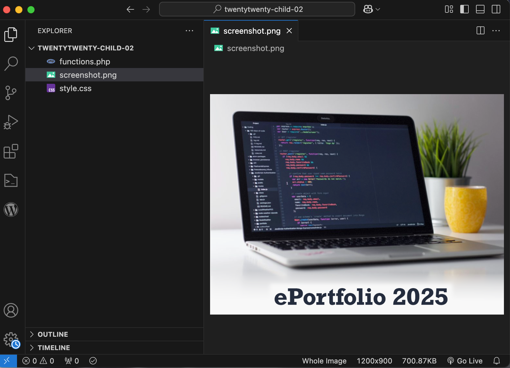
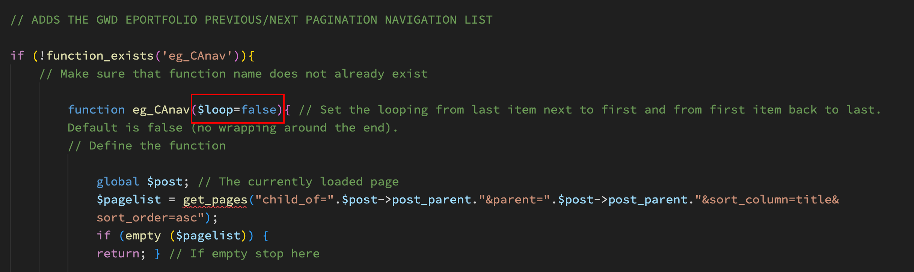

# Week 4 Class Notes

## WordPress PHP Templates

### What is a Template?

A template is a PHP file that:

- Inserts logic (the PHP "functionality") into an HTML page. 
- The more complex the template, aka "abstracted", the less HTML it contains.
- The template uses "includes" to call in other PHP files instead of rewriting their functionality all over again (similar to [object oriented programming](https://en.wikipedia.org/wiki/Object-oriented_programming)).

#### Examples

1. The PHP queries the database for the "next" page and inserts that page's URL into the HTML \<a> tag.
2. The PHP queries the database for the page's content and inserts the HTML into the \<main> or \<article> tag.

## Adding Pagination to the CA pages

### Step 1: Adding a TwentyTwenty child theme to your Wordpress portfolio

<blockquote>

### Important!

Because we **cannot customize a theme directly** (because any changes will get overridden by a future theme update), we must create a child theme to keep our modifications safe (because they are in a separate folder).

</blockquote>

1. On your GWD portfolio site, make sure you have the **TwentyTwenty theme** activated.
   1. Login to your portfolio site's backend admin area.
   2. Go to Appearance > Themes
   3. Check which theme is at left.
2. Delete any other Twenty-something themes **but one**. (Too many unactivated themes represent a security vulnerability.)
3. Install a child theme plugin such as [this one](https://wordpress.org/plugins/wp-child-theme-generator/).
4. Use the plugin to create a child theme.
5. Activate the child theme.
6. If it loads properly, you can delete the child theme plugin.

### Step 2: Copy the child theme to your machine

1. Login to your portfolio site using FileZilla.
1. Navigate to /home/yourname/public_html/wp-content/themes/
2. Select the child theme folder 
3. Download the child theme folder to your desktop.

### Step 3: Add the functionality templates

In order to add new functionality to the portfolio web site, we need to:

- Create a new PHP/HTML template that can be later assigned to WordPress pages from the admin backend.
- Add any logic code the template requires to functions.php

The GWD portfolio site needs two new templates:

- A thumbnails page with the appropriate HTML tags and CSS classes.
- A highres page with pagination.

1. Copy the [thumbs.php](./week-4/thumbs.php) and [highres.php](./week-4/highres.php) template files to your child theme's folder on the local computer.
2. **Copy the contents of** [pagination.php](./week-4/pagination.php) into the functions.php file in the child theme folder.
3. Make sure no code turns red in the functions.php file.

### Step 4: Create a theme thumbnail 

1. In Photoshop, create a blank 1200x900 pixel canvas.
2. Add any artwork you like.
3. Make sure you name is legible on it.
4. Save a copy of the file as "screenshot.png" in the child theme folder. (The name is critically important!)

### Step 5: Customize the Icons

We will add icons to the pagination.php file:

- Previous icon (search for: class="left-icon")
- Back to Gallery (the CA thumbnails page) icon (search for: class="middle-icon")
- Next icon (search for: class="right-icon")

#### Option 1: Add a SVG

1. Design an icon in Adobe Illustrator or Inkscape.
2. Save it as an SVG file.
3. Drag and drop the svg file onto ImageOptim.
4. Open the optimized SVG in your text editor.
5. Copy the svg code (without the DTD XML part).
6. Replace the SVG in the functions.php file with your SVG code.
7. Save the file.
8. Repeat for the other two icons.
9. Save the file.

#### Option 2: Add a PNG or JPG

1. Create a canvas in Adobe Photoshop or GIMP that is **twice the size you need**. For example, if you need a 100px square icon, make a 200px x 200px Photoshop document.
2. Save it as an PNG or JPG file.
3. Drag and drop the image file onto ImageOptim.
4. Temporarily move the image file into VS Code.
5. Right-click the image file and select "Encode: to base64".
6. Replace the SVG in the functions.php file with the code you just copied.
7. Save the file.
8. Repeat for the other two icons.
9. Save the file.

### Step 6: Upload the child theme

To enable the child theme, you have two options:

#### Install via the theme installer

1. Zip the child theme.
2. Login to your portfolio site's backend admin area.
3. Go to Appearance > Themes
4. Click "Add new theme"
5. Upload theme > select your child theme zip archive.
6. Activate the new theme.

#### Install via FTP

1. Login to your portfolio site using FileZilla.
2. Navigate to /home/yourname/public_html/wp-content/themes/
3. Upload the child theme folder 
4. Login to your portfolio site's backend admin area.
5. Go to Appearance > Themes
6. The new child theme should be there.
7. Activate the theme.

### Step 7: Assign the new template to the CA pages

1. Login to your portfolio site's backend admin area.
2. Go to Pages > All Pages.
3. Click "Screen Options" at top right.
4. Change the "Number of items per page" to 100.
5. Click "Apply".
6. Click the checkbox next to all the pages that have a — in front of them (all the pages that are children of "Comprehensive Assessment"). 
7. Select Bulk Actions > Edit at the top left of the pages table.
8. Click "Apply".
9. Change the template to "Highres".
10. Click "Update".

### Step 8: Verify the results

1. Go to your GWD portfolio site.
2. Visit a comprehensive assessment page.
3. Does the pagination appear on the page?
4. Does the pagination work (going back/up/next)?
5. Do the icons display properly?

### Step 9: UX consideration

Do you prefer to have:

- The first page not having a back link (that goes to the last page). The downside of this is that the user can forever go around the portfolio in circles. (Same for the last page going forward to the first.)
- Have a hard stop before page one and after the last page?

To switch in between the two options, change the **$loop=false** value to true in functions.php:

