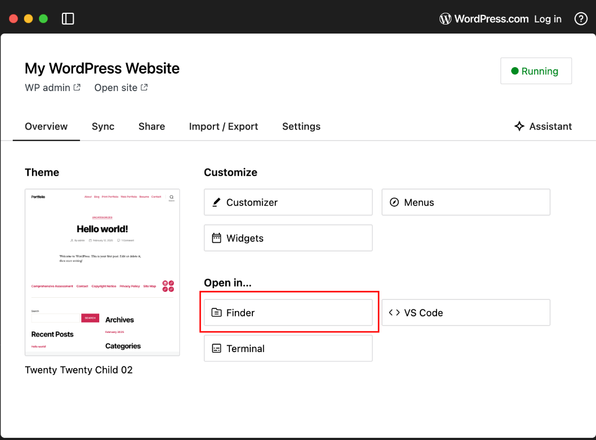

# Week 5 Course Notes

This week we will examine our portfolio navigation for responsiveness.

## Responsive iFrame for Testing Responsiveness

- Download [this file](https://github.com/JACGWD/Responsive-iFrames/blob/main/wordpress.php) into the **top level of the Wordpress Studio folder**.
- (You can automatically open the proper folder by clicking "Open in... Finder" on the Wordpress Studio home screen.)

- Open your WordPress Studio Site in your web browser and navigate to the Sample Page (or a comprehensive assessment demo if you have one). For example: http://localhost:8883/sample-page
- Copy the URL of the page
- Open the wordpress.php page in VS Code
- Edit the $url variable to match the actual address in use on your computer

        <?php
            $url = 'http://localhost:8883/sample-page';
        ?>
        <!DOCTYPE html>

- Save the file
- In WP Studio, click "Open Site".
- Add "/wordpress.php" to the end of the URL in the browser's address bar.

## Examining a Layout for Responsiveness

    .page-template-highres .flex-container {
            width: 1024px;  /* fixed widths are not responsive */
            margin: 2rem auto;
        }

        .page-template-highres h1 {
            width: 1024px;  /* fixed widths are not responsive */
            margin: 2rem auto;
        }

        .page-template-highres .pagination {
            padding:0;
            list-style-type:none;
            width: 1024px;   /* fixed widths are not responsive */
            margin: 2rem auto;
            display: flex;
            flex-direction: row;
            justify-content: space-between;
        }

        .pagination svg {
            fill:#888;
            height:2rem;
            width:auto;
            display: block;
            margin: 1rem auto;
        }

        .pagination li {
            margin: 0; 
            padding: 0; 
            width: 30%; 
            text-align: center;
            }

        .page-template-highres main figure img {
            display: block;
            margin: 1rem auto;
        }

## Responsive Changes

        .page-template-highres .flex-container {
        /* width: 1024px; */
        max-width: 1024px;
        }

        .page-template-highres .pagination {
        /* width: 1024px; */
        /* flex-direction: row; */
        max-width: 1024px;
        flex-direction: column;
        }

        .pagination li {
        /* width: 30%; */
        }

## CSS Modifications

        .page-template-highres .flex-container {
            max-width: 90vw;
        }

        .page-template-highres .pagination {
            border: 1px solid red;
        }

        #site-content {
            /* overflow: hidden; */
            overflow: visible;
        }
