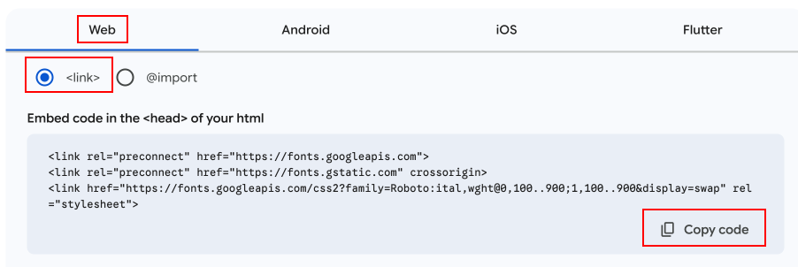
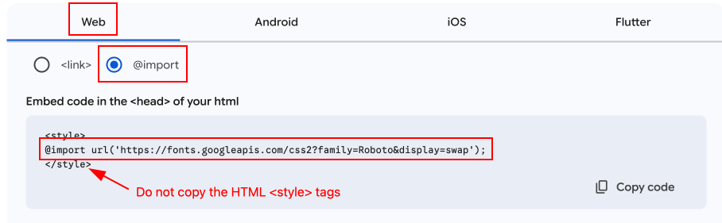

# Week 6b Course Notes

## Optional Techniques to help add style to the pagination

### 1. Adding a Custom Font

#### 1a. Adding a Google font via the \<head> tag (recommended practice)

To add code to the \<head> tag, we will need to copy a file from the parent theme into the child theme.

1. Choose the font you wish to use on Google Fonts.
   1. Click the blue "Get Font" button at top right.
   2. Click the "Get Embed Code" button at top right.
2. If the chosen font is a **variable** font, use the sliders in the left box to customize which font weight you want.
3. In VS Code, copy the "header.php" file from the twentytwenty (parent) theme folder and paste it into the twentytwenty-child (child) theme folder.
4. Open the "twentytwenty-child/header.php" file in VS Code.
5. On the Google Fonts page:
   1. Click "Web"
   2. Select \<link>
   3. Copy the code

6. In VS Code, paste the three lines of code **inside the \<head> tag** (ideally just before \</head>)

            <link rel="preconnect" href="https://fonts.googleapis.com">
            <link rel="preconnect" href="https://fonts.gstatic.com" crossorigin>
            <link href="https://fonts.googleapis.com/css2?family=Roboto:ital,wght@0,100..900;1,100..900&display=swap" rel="stylesheet">
        </head>

7. Save the file.
8. Add the relevant CSS code to your style.css file:

        .page-template-highres .pagination li a {
            font-family: Roboto, "Helvetica Neue", Helvetica, Arial, sans-serif;
            font-weight: 700;
        }
9. Save the file.
10. Go to the "Upload" section below.

#### 1b. Adding via CSS @import (slower performance)

How to add @import code to the CSS file of your child theme.

1. Choose the font you wish to use on Google Fonts.
   1. Click the blue "Get Font" button at top right.
   2. Click the "Get Embed Code" button at top right.
2. If the chosen font is a **variable** font, use the sliders in the left box to customize which font weight you want.
3. In VS Code, open your CSS stylesheet.
5. On the Google Fonts page:
   1. Click "Web"
   2. Select @import
   3. Copy the code

6. In VS Code, paste the line lines of code **at the top of the CSS stylesheet** (do not paste HTML tags into a CSS file)

            @import url('https://fonts.googleapis.com/css2?family=Roboto&display=swap');

7. Save the file.
8. Add the relevant CSS code to your style.css file:

        .page-template-highres .pagination li a {
            font-family: Roboto, "Helvetica Neue", Helvetica, Arial, sans-serif;
            font-weight: 700;
        }

9. Save the file.
10. Add the modified code to your live web site:
    1.  Copy the modified CSS code and paste it directly in the CSS editor on WordPress (Appearance > Theme File Editor) and then save the file.
    2.  Or, go to the "Upload" section below.

#### 2. Uploading the Custom Font

##### 2.1 Upload the modified theme to your child theme on the live server (Zip)

This technique is safest, as you are creating a zip backup of your theme in case something goes wrong at a later time.
 
   1. Zip the child theme folder
   2. Move it outside of WP Studio (back it up)
   3. Go to the Appearance > Themes section on your web portfolio WordPress site.
   4. Click "New Theme"
   5. Click "Upload Theme"
   6. Select your child theme zip file
   7. Upload
   8. Confirm that you want to replace the child theme that already exists.
   9. Activate the child theme
   10. Delete the cache on your browser to make sure you see the updated files.

##### 2.2 Upload the modified theme to your child theme on the live server (FileZilla)

   1. Open FileZilla
   2. Click Server > Reconnect (command-R)
   3. In FileZilla's left-hand window, navigate to where your child theme exists (in WP Studio: /Users/yourname/Library/CloudStorage/OneDrive/Web-IV/WPStudioSite/wp-content/themes/twentytwenty-child/)
   4. In FileZilla's right-hand window, navigate to where your child theme exists (on CPanel: /home/yourname/public_html/wp-content/themes/twentytwenty-child/)
   5. Upload the modified files (style.css and possibly header.php)
   6. Confirm that you want to replace the files that already exist.
   7. Delete the cache on your browser to make sure you see the updated files.

### 2. Background Images

For this technique, add an "img" folder inside the wp-content/themes/twentytwenty-child/ folder.

This technique adds a background image to the list item, which appears **behind the anchor tag text and svg**.

    .pagination li {
        background-repeat: no-repeat;
        background-size: cover;
    }

    /* first rule applies to all list items inside .pagination */

    /* next three rules are more specific: an extra class to tell the three different list items apart */
    
    .pagination li.previous-page {
        background-image: url(img/left-wing.png);
    }

    .pagination li.up-to-gallery {
        background-image: url(img/bird.png);
    }

    .pagination li.next-page {
        background-image: url(img/right-wing.png);
    }

*Remember to run your images through ImageOptim after creating them.*
   
#### Silly example, but you get the point…

        /* SILLY EXAMPLE CODE, CHANGE AS YOU WISH */
        
        @media screen and (min-width: 102.4rem) {

        .pagination li.previous-page {
            background-image: url(img/left-wing.png);
            background-size: cover;
            background-repeat: no-repeat;
            /* add one instance of the wings, no tiling, sized to fit */

            width: 45%;
            /* much wider than the middle button */
        }
    

        .pagination li.up-to-gallery {
            width: 10%;
            /* narrow center button */

            border: 4px solid #b4181f;
            border-radius: 18px;
            ?* add box with rounded corners */
        }

        .pagination li.next-page {
            width: 45%;
            background-image: url(img/right-wing.png);
            /* add other wing */

            background-size: 107%;
            background-repeat: no-repeat;
            background-position-x: 101%;
            background-position-y: 83%;
            /* tweak wing size and alignment */
        }

        .pagination li {
            height: 16rem;
            /* make the list item box taller so we can fit the wings */
        }

        .pagination li span {
            font-size: 2.5rem;
            font-weight: bold;
            margin-top: 6rem;
            /* link text is bigger, bolder, and moved down */
        }

        .pagination a:link, 
        .pagination a:visited, 
        .pagination a:hover, 
        .pagination a:active {
            color: #b4181f;
            /* change text color of pagination links */
        }

        .up-to-gallery .page-link {
            position: relative;
            top: -5rem;
            /* move middle link text up */
        }

        .page-template-highres .up-to-gallery svg.middle-icon {
            position: relative !important;
            top: 1rem;
            left: calc(50% - 9rem);
            fill: #b4181f;
            /* move middle svg icon up */
        }

        } /* always add comment next to closing media query bracket */

#### Other examples

[https://dribbble.com/RamiroGalan](https://dribbble.com/RamiroGalan)

[https://agentestudio.com/blog/pagination-design-examples-and-best-practices](https://agentestudio.com/blog/pagination-design-examples-and-best-practices)

### 2. Change the SVG Stroke & Fill

Depending on the size and how the SVG was originally designed, adding stroke and fill colors directly via CSS can look wonderful or absolutely terrible. It is worth a try. You can always just open the SVG in Illustrator and redesign it. Remember to **run the SVG through ImageOptim** again after you have resaved it.

        .pagination li a svg.middle-icon {
            stroke: black;
            fill: yellow;
        }

### 3. Micro interactions

You can add some "life" to your design, by making the icons react to your mouse position. (Add this into the media query, as there is no hover state on touch devices.)

        @keyframes wiggle {
            0% { transform: rotate(0deg); }
            40% { transform: rotate(4deg); }
            95% { transform: rotate(-4deg); }
            100% { transform: rotate(0deg); }
        }

       .pagination li a:hover svg  {
            animation: wiggle 0.5s infinite;
        }

### 4. Interactive State Effects

You can change the appearance of the SVGs **on hover**:

        .pagination li a:hover svg {
            stroke: black;
            fill: yellow;
        }

You can also add or modify a background image **on hover**:

(See what we did last semester with the colored navigation images [in the pet shop](https://billypoppins.dev.graphicandwebdesign.ca/pet-shop-php-version/index.php)!)

        .pagination li {
            background-color: #fc5000;
            background-image: url(img/unsplash.jpg);
            background-blend-mode: overlay;
        }

        .pagination li:hover {
            background-color: #fc5000;  /* option 1: change color on hover */
            background-image: unset; /* option 2: completely remove image on hover */
            background-blend-mode: multiply; /* option 3: change blending mode on hover */
        }

<figcaption>

### NOTE

If you are having problems with your CSS rules not being specific enough to "kick in", **add ".page-template-highres" at the beginning** of your CSS selector.

</figcaption>
