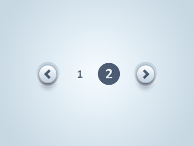
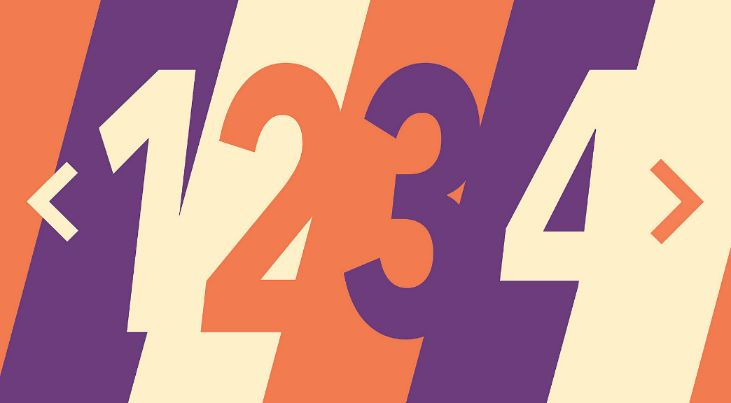

# Week 6b Course Notes

## Optional Techniques to help add style to the pagination

### 1. Background Images

For this technique, add an "img" folder inside the wp-content/themes/twentytwenty-child/ folder.

This technique adds a background image to the list item, which appears **behind the anchor tag text and svg**.

    .pagination li {
        background-repeat: no-repeat;
        background-size: cover;
    }

    /* first rule applies to all list items inside .pagination */

    /* next three rules are more specific: an extra class to tell the three different list items apart */
    
    .pagination li.previous-page {
        background-image: url(img/left-wing.png);
    }

    .pagination li.up-to-gallery {
        background-image: url(img/bird.png);
    }

    .pagination li.next-page {
        background-image: url(img/right-wing.png);
    }

*Remember to run your images through ImageOptim after creating them.*
   
#### Silly example, but you get the point…

        /* SILLY EXAMPLE CODE, CHANGE AS YOU WISH */
        
        @media screen and (min-width: 102.4rem) {

        .pagination li.previous-page {
            background-image: url(img/left-wing.png);
            background-size: cover;
            background-repeat: no-repeat;
            /* add one instance of the wings, no tiling, sized to fit */

            width: 45%;
            /* much wider than the middle button */
        }
    

        .pagination li.up-to-gallery {
            width: 10%;
            /* narrow center button */

            border: 4px solid #b4181f;
            border-radius: 18px;
            ?* add box with rounded corners */
        }

        .pagination li.next-page {
            width: 45%;
            background-image: url(img/right-wing.png);
            /* add other wing */

            background-size: 107%;
            background-repeat: no-repeat;
            background-position-x: 101%;
            background-position-y: 83%;
            /* tweak wing size and alignment */
        }

        .pagination li {
            height: 16rem;
            /* make the list item box taller so we can fit the wings */
        }

        .pagination li span {
            font-size: 2.5rem;
            font-weight: bold;
            margin-top: 6rem;
            /* link text is bigger, bolder, and moved down */
        }

        .pagination a:link, 
        .pagination a:visited, 
        .pagination a:hover, 
        .pagination a:active {
            color: #b4181f;
            /* change text color of pagination links */
        }

        .up-to-gallery .page-link {
            position: relative;
            top: -5rem;
            /* move middle link text up */
        }

        .page-template-highres .up-to-gallery svg.middle-icon {
            position: relative !important;
            top: 1rem;
            left: calc(50% - 9rem);
            fill: #b4181f;
            /* move middle svg icon up */
        }

        } /* always add comment next to closing media query bracket */

#### Other examples

[https://dribbble.com/RamiroGalan](https://dribbble.com/RamiroGalan)

[https://agentestudio.com/blog/pagination-design-examples-and-best-practices](https://agentestudio.com/blog/pagination-design-examples-and-best-practices)

### 2. Change the SVG Stroke & Fill

Depending on the size and how the SVG was originally designed, adding stroke and fill colors directly via CSS can look wonderful or absolutely terrible. It is worth a try. You can always just open the SVG in Illustrator and redesign it. Remember to **run the SVG through ImageOptim** again after you have resaved it.

        .pagination li a svg.middle-icon {
            stroke: black;
            fill: yellow;
        }

### 3. Micro interactions

You can add some "life" to your design, by making the icons react to your mouse position. (Add this into the media query, as there is no hover state on touch devices.)

        @keyframes wiggle {
            0% { transform: rotate(0deg); }
            40% { transform: rotate(4deg); }
            95% { transform: rotate(-4deg); }
            100% { transform: rotate(0deg); }
        }

       .pagination li a:hover svg  {
            animation: wiggle 0.5s infinite;
        }

### 4. Interactive State Effects

You can change the appearance of the SVGs **on hover**:

        .pagination li a:hover svg.middle-icon {
            stroke: black;
            fill: yellow;
        }

You can also add or modify a background image **on hover**:

(See what we did last semester with the colored navigation images in the pet shop!)

        .pagination li {
            background-color: #fc5000;
            background-image: url(img/unsplash.jpg);
            background-blend-mode: overlay;
        }

        .pagination li:hover {
            background-color: #fc5000;  /* option 1: change color on hover */
            background-image: unset; /* option 2: completely remove image on hover */
            background-blend-mode: multiply; /* option 3: change blending mode on hover */
        }

