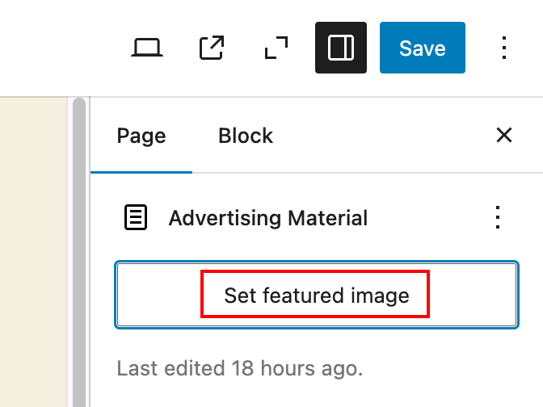

# Week 7 Notes

## Master and Detail Page Relationship

In computer science, as well as in web design, a well established design pattern is "master and detail". You can think of it as "category and product". Visually, it often means "thumbnails overview page" and "highres details page". This is why our CA templates are called "thumbs" and "high res". 

Two examples of master/detail relationship design:

- [https://cms-modals.webflow.io/#](https://cms-modals.webflow.io/#)
- [https://ajax-load-team-members.webflow.io/](https://ajax-load-team-members.webflow.io/)

## Populating the CA Thumbnails page

There are a few steps for automatically populating the CA thumbnails page:

- Download the new [thumbs.php (updated with a custom query)](./week-7/thumbs.php)
- Make sure post number on line 23 is accurate (on your live portfolio site)
- Upload the new thumbs.php

### How to display the page ID in the WordPress backend

Paste this code into the functions.php file of your child theme (on your live portfolio site):

        // =================  START FIND PAGE ID ============================== //

        function add_column( $columns ){
            $columns['page_id_clmn'] = 'ID'; // $columns['Column ID'] = 'Column Title';
            return $columns;
        }
        add_filter('manage_pages_columns', 'add_column', 5);
        // adds column in position 5

        function column_content( $column, $id ){
            if( $column === 'page_id_clmn')
                echo $id;
        }
        add_action('manage_pages_custom_column', 'column_content', 5, 2);

        // =================  END FIND PAGE ID ============================== //

### Featured Images are Required

The new code in thumbs.php displays the **featured image**, not the image uploaded inside the page content. You will need to assign a featured image for each page of the CA.

1. Go to any of the pages you have already added a CA image to.
2. Click "Page" in the right sidebar.
3. Click "Set featured image".
4. Click "Media Library".
5. Click the same image as the one you inserted on the page before.
6. Save the page.

### Customize Thumbnail Resolution

Once you have customized the grid (ex: number of columns) for the presentation of the thumbnails, you will need to define the size (and therefore the resolution) of the thumbnails added to the page.

        // =================  START CUSTOM THUMBNAIL SIZE ============================== //

        set_post_thumbnail_size( 250, 165);
        // The parameters for set_post_thumbnail_size are in this order: width, height.

        add_image_size( 'thumbs', 250, 165 );
        // Image size for thumbnails displayed by thumbs.php template
        // 'thumbs' here refers to the parameter on line 61 of thumbs.php: echo the_post_thumbnail('thumbs');

        // =================  END CUSTOM THUMBNAIL SIZE ============================== //

## CSS formatting for the Thumbnails

**This code already exits in your CSS.** We are only adding two new selectors and two extra rules. Pay attention to the comments.

        .page-template-highres .flex-container,  /* add comma here */
        .page-template-thumbs .flex-container /* add this selector */ {

        width: 90vw;
        /* 90% of the width of the viewport */

        max-width: 102.4rem;
        /* 1024px / 10px default font size = 102.4rem */
        /* max-width = box will stretch in width up to 102.4rem then center */

        margin: 0rem auto 2rem auto;
        /* clockwise: right and left are set to auto for centering */
        }

        .page-template-thumbs  figure.thumbnail {  /* add this entire rule */
            width: 90vw;
            max-width: 250px;
            border: 1px solid #444;
            margin: 1rem auto; /* centers figure box in the viewport on mobile */
            padding: 1rem;
        }

        .page-template-thumbs  figure.thumbnail img {  /* add this entire rule */
            display: block;
            margin: 0 auto; /* centers image within the figure */
        }

        /* MAKE H1 BEHAVE SAME AS ABOVE CONTAINER */
        .page-template-highres h1, /* add comma here */
        .page-template-thumbs h1 /* add this selector */ {

   ## CSS for Responsive CSS Grid         

        /* mobile phone: no columns: nothing to do */

        /* for two columns */
        @media screen and (min-width: 32.8125rem) {
            .page-template-thumbs #site-content {
                display: grid; /* define grid once only: first time you want to use it */
                grid-template-columns: 1fr 1fr;
        }
        } /* closes media query */

        /* for three columns */
        @media screen and (min-width: 47.1875rem) {
            .page-template-thumbs #site-content {
                grid-template-columns: 1fr 1fr 1fr;
        }
        } /* closes media query */

        /* for four columns */
         @media screen and (min-width: 102.4rem) {
            .page-template-thumbs #site-content {
                grid-template-columns: 1fr 1fr 1fr 1fr;
        }
        } /* closes media query */
