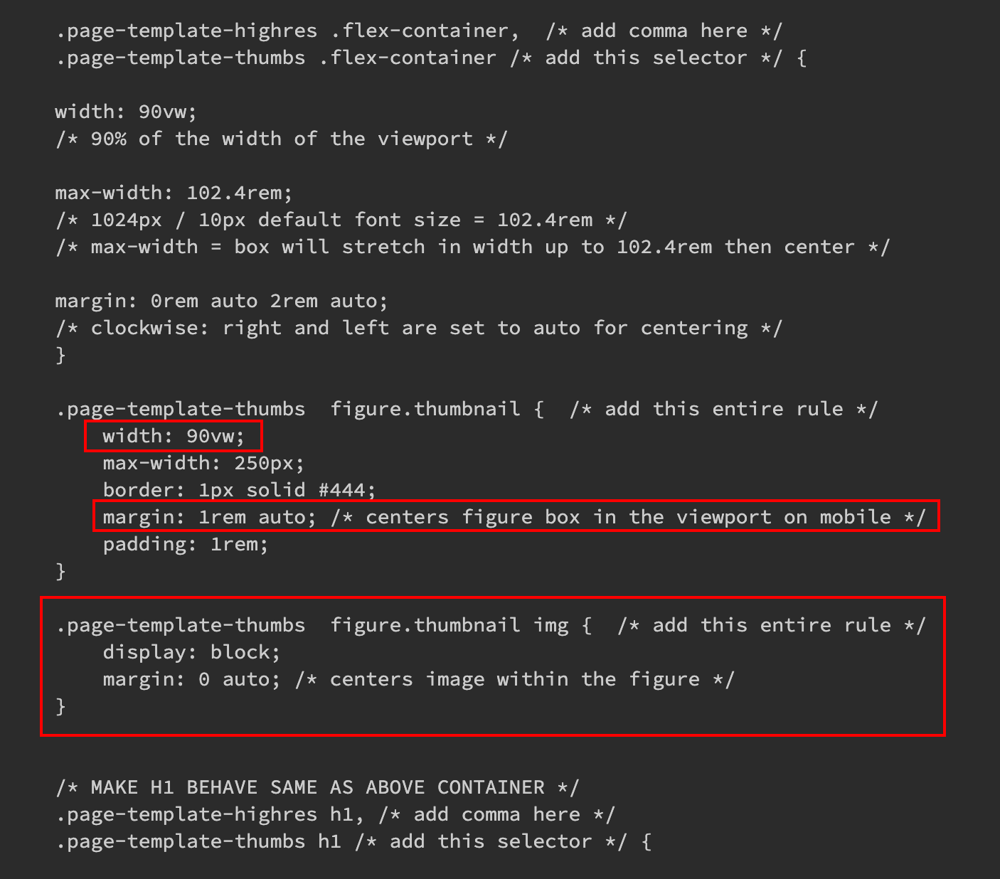
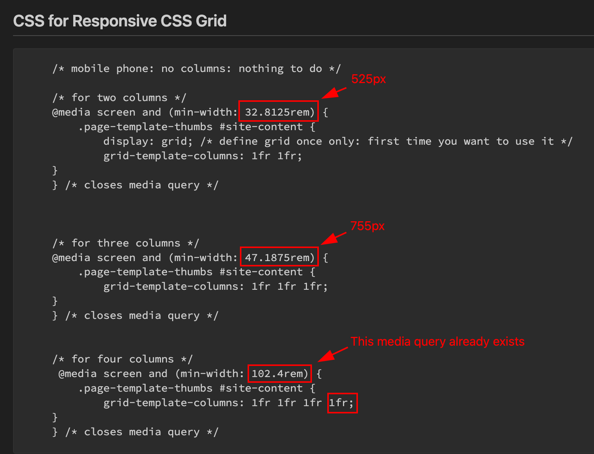

# Week 8 Notes

## Review: Week 7

Code that was updated during/after the second class:

- New Code: Convert media query pixel sizes to rems (divide by 16)
  
  - 525px / 16 = 32.8125rem
  - 755px / 16 = 47.1875rem

## Homework

Convert your assigned Montreal Real Estate pages to blocks, not Divi shortcodes.

**Make sure to use proper HTML.**