# Week 9 Class Notes

## Evaluation of Montreal Real Estate Pages 

1. Is all the content inside a shortcode tag: 0
2. Are there any H1 tags on the page: 7
3. Are there any "fake lists" (paragraphs that start with a manually entered digit or dash/bullet) on the page: 7
4. Are there any "fake headers" (paragraphs that are manually made bigger and bold) on the page: 7
5. Are there any stray/random characters on the page (ex: > at the very end): 7
6. "By Jennifer Walker" paragraph -> assign "byline" as a class: yes: +1 | no: -1

## Homework

### Build a Wordpress Theme from Scratch

<figcaption>

### *Please read all these instructions before starting.* 

</figcaption>

#### Step 1: Create GitHub Repo

#### 1. Sign up for a GitHub account 

1. Open GitHub Desktop
2. Click the Create account link to bring you to the GitHub web site.

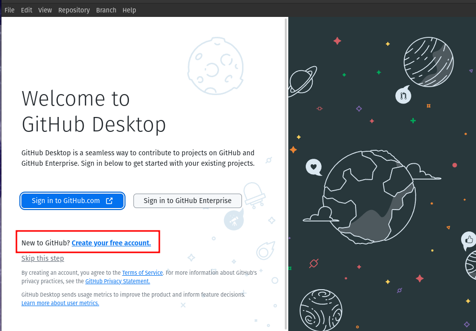

#### 2. Create a new account

On the GitHub web site, use your **school email account and initial + last name** (ex: jsmith).

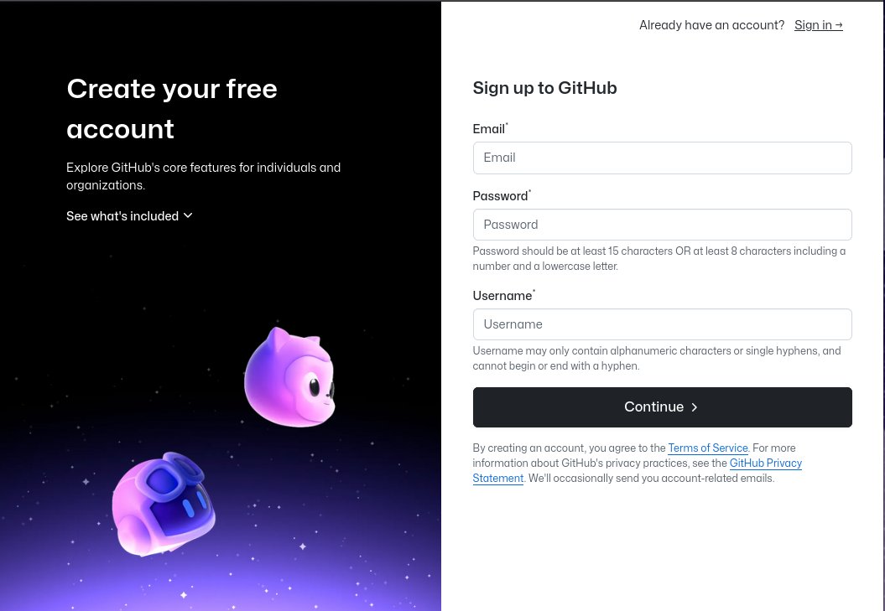

You will be required to authenticate your email address. 

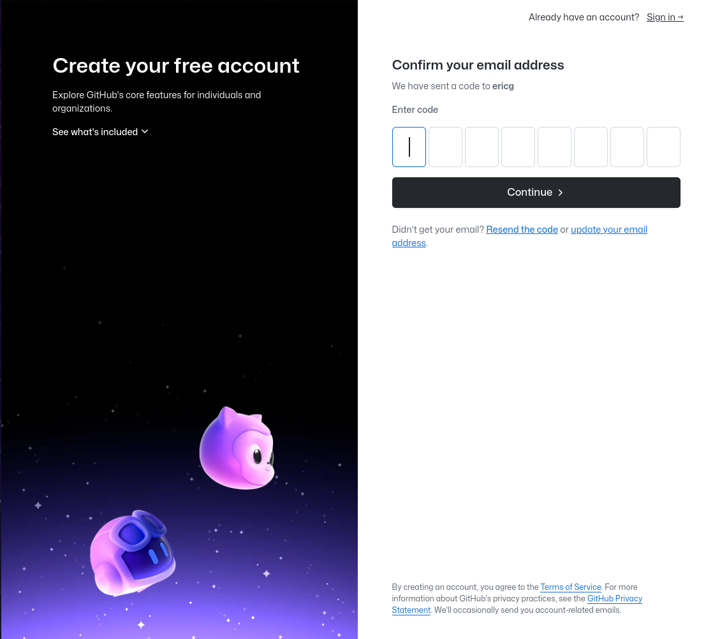

#### 3. Open GitHub Desktop

1. Once you account is created, switch back to GitHub Desktop.
2. Click "Sign In".

#### 4. Sign In to GitHub

These steps will authenticate GitHub Desktop with your GitHub account.

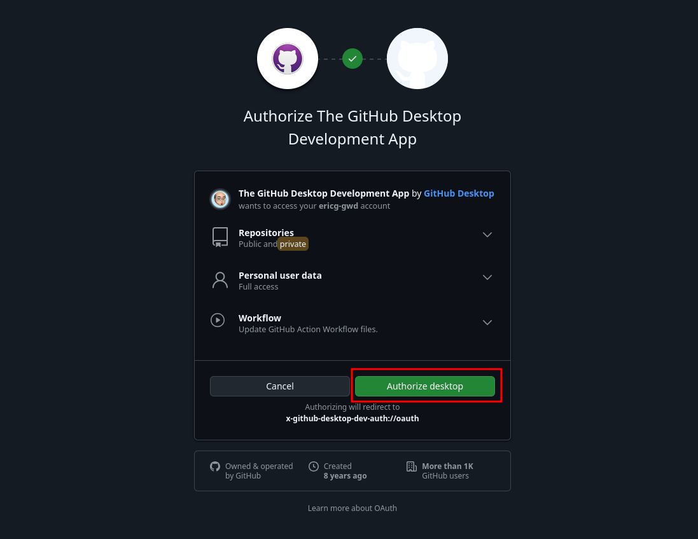

Permit the GitHub web site to connect to the desktop application:

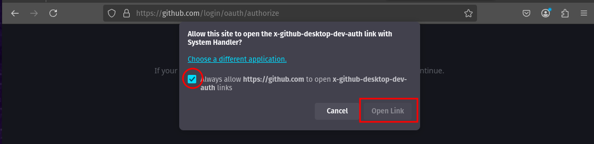

#### 5. Configure Git

Now you will configure Git (the software that GitHub Desktop is the GUI ("Graphic User Interface") for) so that it can connect to your GitHub account.

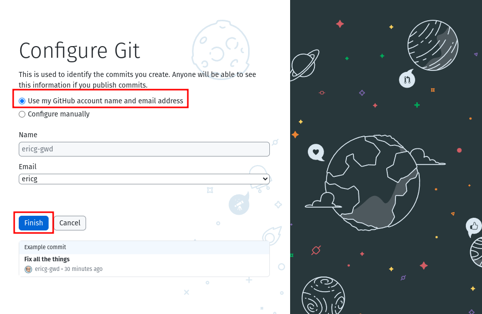

#### 5. Click Create a New Repository on your Hard Drive....

<!--  -->

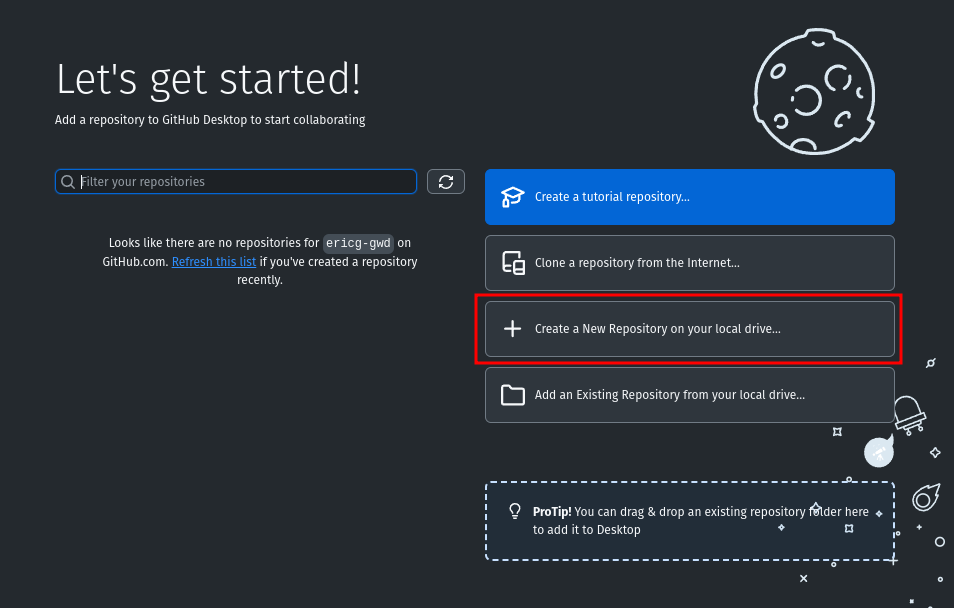

#### 6. Fill in these fields

Beware: The most confusing thing about GitHub Desktop is that it creates the folder one level above where you expect it to be created. In other words, type in the name you want your folder to have, and then **select the parent folder** where you want your folder to be created.

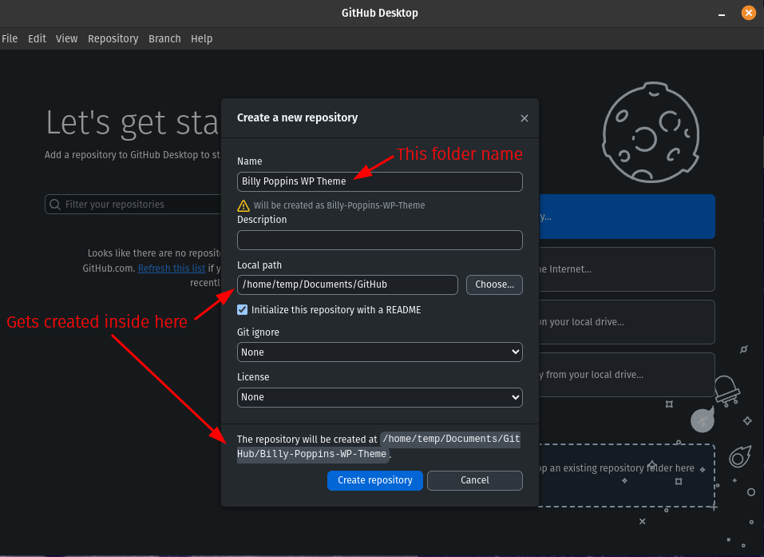

**Make sure to select the /wp-content/themes/ folder in WordPress Studio as the parent folder.**

   - **Name**: "Your Name WP theme"
   - **Description**: (Optional) This is the field where you provide more information about the purpose of your repository. You can use something like "My first WP theme".
   - **Local path**: Sets the location of your repository on your computer. (By default, GitHub Desktop creates a GitHub folder inside your Documents folder to store your repositories, but you normally can choose any location on your computer.)  **In our case we will use a your-name folder inside wp-content/themes/ inside your Wordpress Studio.**
   - **Initialize this repository with a README**: Creates an initial commit with a README.md file. READMEs help people understand the purpose of your project, so it is recommended that you fill it out with helpful information, ie this is your very first theme in the Web IV class at GWD, etc etc. 
  - Click Create repository.  
  - Once the repo is created, click open the project in **Visual Studio Code**.

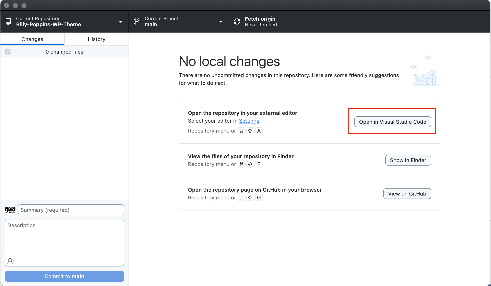

#### 7. Trust the Authors

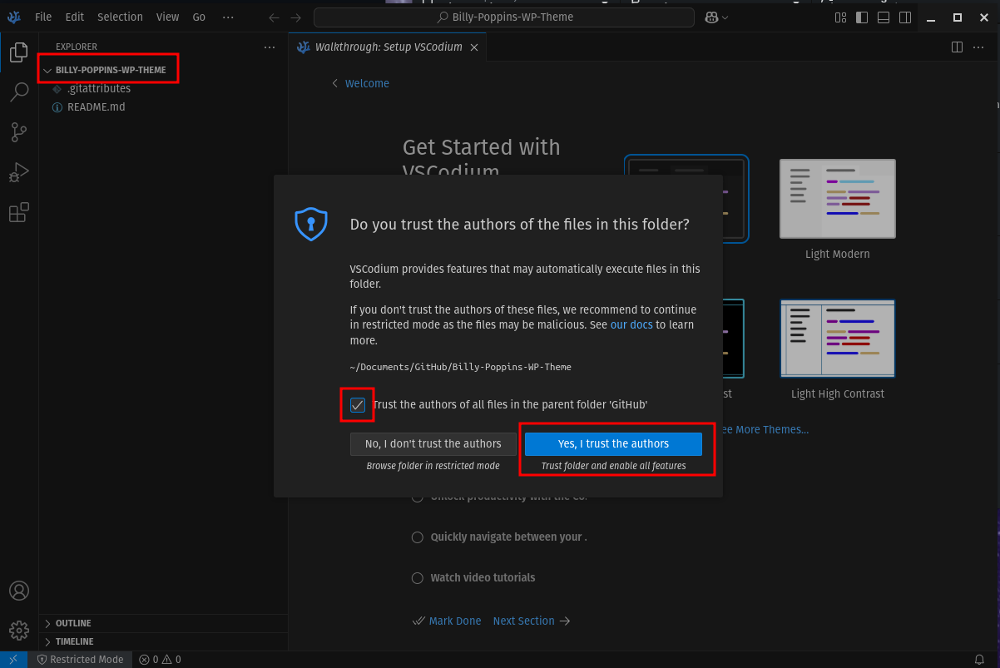

#### 8. Start the WP Theme Project

In Visual Studio Code, complete all of **Step 1** in the [https://github.com/JACGWD/custom-wp-theme-in-25-copy-pastes](https://github.com/JACGWD/custom-wp-theme-in-25-copy-pastes)

#### 9.  Once Step 1 is complete, switch to GitHub Desktop

   1.  In the repository bar, click Publish repository.
   2.  Add the words "Initial Commit" as the first title. 

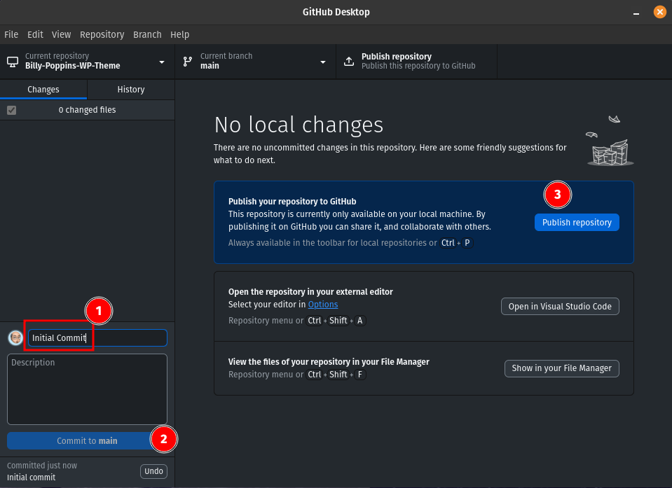

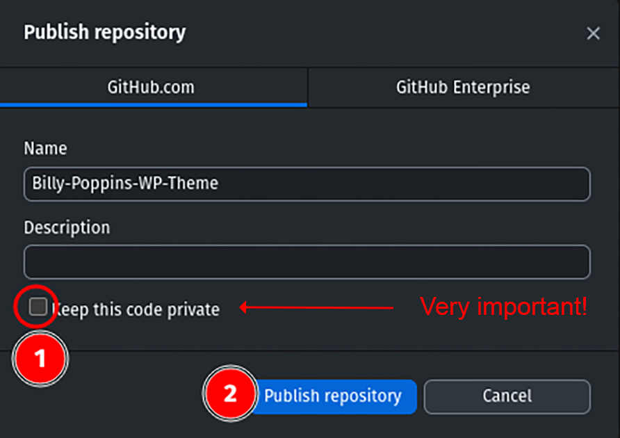

#### 9. Send me the URL to your Work-in-Progress

   - Send me the URL to your repository via MIO (make sure the URL ends in .git)  

#### 10. Upload any Changes with "Commit & Push"

- "Commit": Committing to the fact that the work-in-progress has reached a milestone and is ready to be shared.
- "Push": Actually pushing (ie "uploading) the code to the file server.

Once you have a reached a stepping stone in the project, for example having completed a few steps or are done for the day, sync your code with the repository. Think of it a little like FTP. You are uploading the code to the project's home folder, where others (fellow employees, others who want to collaborate on the project, etc) can see your contributions to the project. 

In our case, I will be able to monitor your progress and possibly suggest improvements.

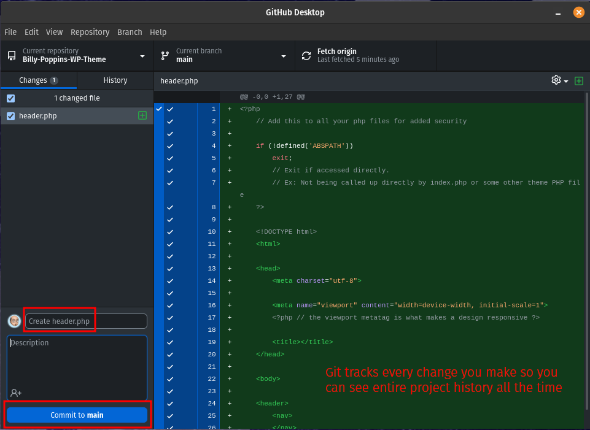

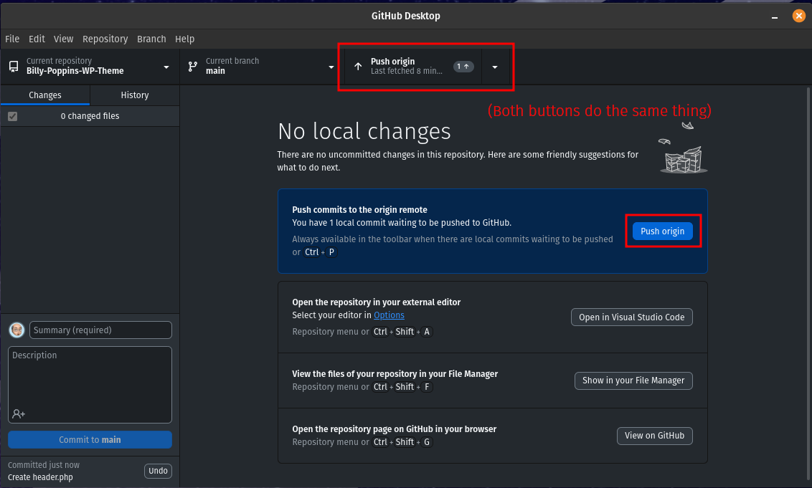

#### 11. Update Often

   1.  Every time you have made substantial changes to your project, save the changes to GitHub. 
   2.  Do this often, GitHub acts like a backup system. You can see your entire history, and revert to any previous edit at any time. 

#### 12. "Pull" on other Machines

If you switch machines at school, or use your home machine to do homework, you will want to sync your changes so that you have the latest copy of the files to work with.

##### First Time: Clone your Repo

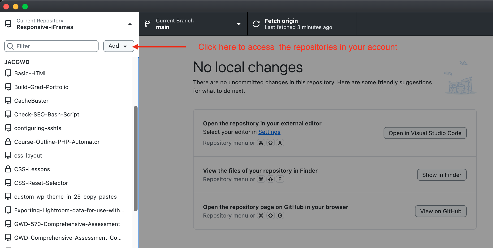

1. Login to your GitHub account with GitHub Desktop
2. Authorize as we did, see above
3. Click the top left corner of GitHub Desktop
4. Click "Add"
5. Choose "Clone Repository"
6. Click the GitHub.com tab (first one)
7. Click the repository you want to clone
8. The destination will be the Wordpress Studio themes folder

##### Every Other Time

1. Open GitHub Desktop
2. Make sure your repository is selected
3. Click "Fetch Origin" to pull changes from the server

### Step 2: Continue Building the Theme

Continue following the step-by-step instructions here: [https://github.com/JACGWD/custom-wp-theme-in-25-copy-pastes](https://github.com/JACGWD/custom-wp-theme-in-25-copy-pastes)

**Remember to save your changes to GitHub often!**

