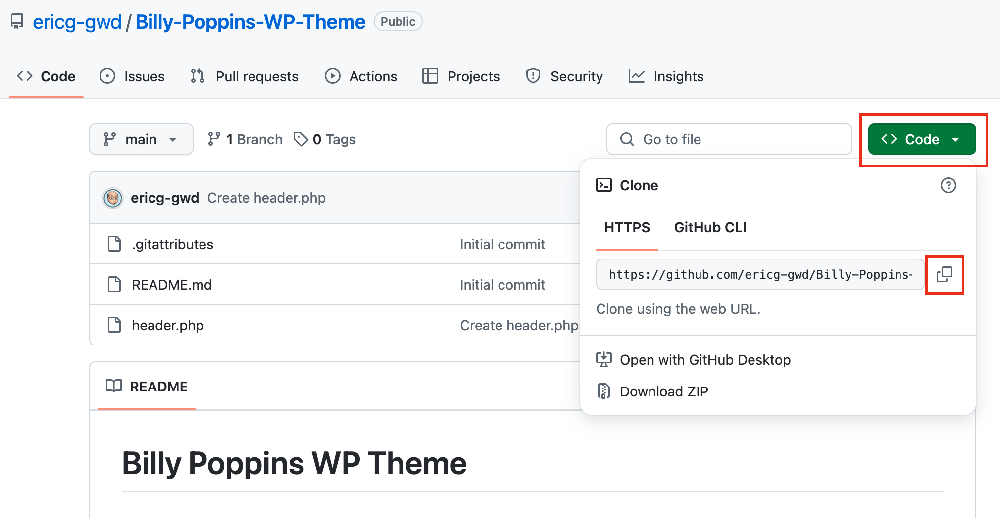

# Week 9 Class Notes

## Evaluation of Montreal Real Estate Pages 

1. Is all the content inside a shortcode tag: 0
2. Are there any H1 tags on the page: 7
3. Are there any "fake lists" (paragraphs that start with a manually entered digit or dash/bullet) on the page: 7
4. Are there any "fake headers" (paragraphs that are manually made bigger and bold) on the page: 7
5. Are there any stray/random characters on the page (ex: > at the very end): 7
6. "By Jennifer Walker" paragraph -> assign "byline" as a class: yes: +1 | no: -1

## Homework

### Build a Wordpress Theme from Scratch

<figcaption>

### *Please read all these instructions before starting.* 

</figcaption>

#### Step 1: Create a GitHub Repository for your Theme

[https://github.com/JACGWD/Create-GitHub-Repository](https://github.com/JACGWD/Create-GitHub-Repository)

#### Step 2: Send me the URL to your Work-in-Progress

   - Send me the URL to your repository via MIO (make sure the URL ends in .git)  

#### Step 3: Building a WP Theme from Scratch

Follow the step-by-step instructions here: [https://github.com/JACGWD/custom-wp-theme-in-25-copy-pastes](https://github.com/JACGWD/custom-wp-theme-in-25-copy-pastes)

**Remember to push your changes to GitHub often!**

